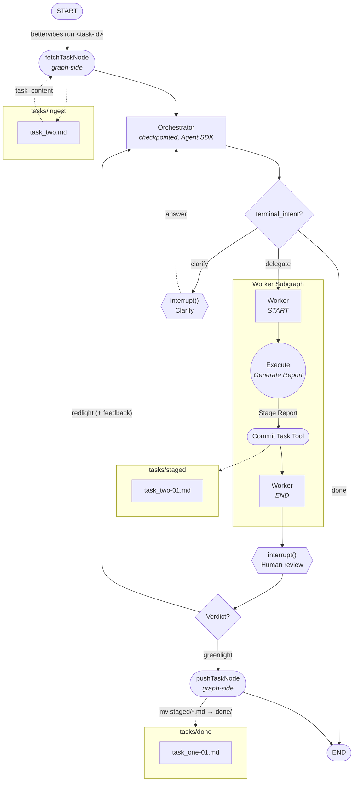

# *Orchestration Specification for BetterVibes* — Version 1

## Navigation Table

| § | Topic |
| - | ----- |
| [1](#1-the-conversation-to-date) | The Conversation to Date |
| [2](#2-file-structure) | File Structure |
| [3](#3-agent-types) | Agent Types |
| [4](#4-control-flow) | Control Flow |
| [5](#5-task-management) | Task Management |
| [6](#6-context-management) | Context Management |
| [7](#7-project-structure) | Project Structure |
| [8](#8-honorable-mentions) | Honorable Mentions |

---

## 1. The Conversation to Date

This spec defines the orchestration layer for BetterVibes: a LangGraph-based system with two agent types (orchestrator and worker) operating in a sequential loop with human-in-the-loop review. It replaces an earlier hooks-based approach that lacked the ability to discriminate between agent types.

### 1.1. Context

The primary stakeholder is the human developer. They need a system that retrieves tasks, delegates work to an executor agent, and presents finished reports for review — with the ability to accept or reject results and maintain orchestrator awareness across multiple tasks.

### 1.2. Decisions

- LangGraph over hooks-based orchestration.
    - Hooks fire uniformly regardless of agent type. The orchestration layer requires graph-aware routing with explicit state machines, conditional edges, and per-node control.
- Two agent types: orchestrator and worker.
    - The orchestrator is the planning and delegation layer. The worker is a pure executor. Separation keeps responsibilities clean and context requirements distinct.
- Sequential execution model.
    - One task at a time: retrieve → instruct → delegate → review. No parallelism in v1.
- Human-in-the-loop review, not LLM-driven review.
    - The orchestrator presents the finished report to the human via a deterministic tool call. The human is the reviewer, not the orchestrator.
- Filesystem-based task management.
    - Low-tech, IDE-friendly. Markdown files in directories. Filenames serve as task IDs.
- Three-directory structure: `tasks/ingest/`, `tasks/staged/`, `tasks/done/`.
    - `tasks/ingest/` is the permanent source of truth. `tasks/staged/` holds reports awaiting review. `tasks/done/` holds greenlit reports. On greenlight, a deterministic `mv` tool moves all staged iterations of the task from `tasks/staged/` to `tasks/done/`.
- Tasks are never removed.
    - `tasks/ingest` is documentation, not a consumable queue.
- Iteration numbering on reports.
    - Suffix `-01`, `-02`, etc. on report filenames tracks rework iterations in the redlight case.
- Baseline-reset compaction on greenlight.
    - The orchestrator's `messages` array is reset to the baseline (post-spec-ingest state) with an accumulated-notes log appended. See §6.
- Single-run execution model per task.
    - The graph terminates after one successful greenlight. The human re-initiates the next task by starting a new run. There is no autonomous loop between tasks.
- Checkpointer under a stable `thread_id`.
    - Within a run: enables pause/resume at `HUMAN_INT` and `CLARIFY` interrupts.
    - Across runs: preserves the orchestrator's `messages` (baseline + notes) so the next task-run inherits awareness of completed work without starting the conversation from scratch.
- Empty queue check as conditional edge.
    - After retrieval, the queue check verifies whether a task was received. If yes, proceed to the worker; if no, the graph raises per the fail-loud policy. A missing task, an invalid task-id, or an empty `tasks/ingest/` all fall into the fail-loud branch.
- Dedicated `bettervibes` package in the monorepo.
    - Orchestration logic is application code with runtime dependencies (`@langchain/langgraph`, `@langchain/core`, `@anthropic-ai/claude-agent-sdk`), not configuration. Keeping it out of `.claude/` preserves the separation between agent config and orchestration runtime. A dedicated package gets its own `package.json`, build, and entry point.
- Fail-loud error policy.
    - On any fatal error (worker crash, tool failure, filesystem error, `mv` target exists), the graph raises and the CLI exits non-zero with the error. The checkpointer preserves state so the human can diagnose and retry manually. No auto-retry or recovery logic in v1.
- `bettervibes` package is extractable.
    - The package is designed to be liftable into a standalone project. No cross-package dependencies flow into `bettervibes` — schemas, types, and utilities stay private rather than being exported to `@bettervibes/shared`.
- Single constant `thread_id`.
    - The orchestrator uses a fixed thread_id (`"bettervibes-main"`). The checkpointer is `SqliteSaver` persisting state at `.bettervibes/checkpoint.sqlite` (gitignored). To start fresh, delete the checkpoint file.
- Claude Code integration lives in `.claude/skills/`.
    - The human talks to Claude Code in natural language; Claude Code translates to `bettervibes` CLI calls via a snippet in the consumer project's `.claude/CLAUDE.md` (see `quick_start_guide.md`). The snippet and the `bettervibes` CLI communicate solely through the CLI contract (§4.4).
- Worker uses the Claude Agent SDK.
    - Rather than hand-rolling a ReAct agent, the worker wraps Anthropic's `@anthropic-ai/claude-agent-sdk` — the library form of Claude Code. This inherits Claude Code's tool set, agent loop, and prompt engineering instead of re-engineering it.
- Two-tier interrupt model.
    - Coarse interrupts (`HUMAN_INT`, `CLARIFY`) exit the process and resume via `bettervibes resume` backed by the checkpointer. Fine interrupts (tool-permission prompts from inside the worker) pause the SDK's `canUseTool` callback on an in-process promise and exchange newline-delimited JSON with Claude Code over stdout/stdin. The SDK's agent loop cannot be serialized across process exits, so mid-task permission prompts must stay in-process.
- Permission mediation via `PermissionGate`.
    - The worker exec node receives a `PermissionGate` through LangGraph's `RunnableConfig.configurable`. The gate owns a base allowlist (the six Claude Code default tools: `Read`, `Edit`, `Write`, `Bash`, `Glob`, `Grep`) and a session allowlist learned during the run. Tools on either list run silently; anything else emits a `permission_request` event (see §4.4) and blocks until a `permission_response` lands. The human answers `allow`, `deny`, or `allow_session`. `deny` returns a denial to Claude's agent loop (Claude adapts or gives up and the run fails loud). `allow_session` approves the tool for the remainder of the Node process; it does not persist across `bettervibes resume`.
- Worker falls back to `dontAsk` when no gate is injected.
    - If `execNode` runs without a `PermissionGate` (tests, or a future non-interactive caller), the SDK is configured with `permissionMode: 'dontAsk'`: allowlisted tools run, everything else is silently denied. No prompts, no session learning.
- Orchestrator also uses the Claude Agent SDK (not `@langchain/anthropic`).
    - `ChatAnthropic` authenticates exclusively via the public Messages API (API billing). Switching the orchestrator to `@anthropic-ai/claude-agent-sdk` — the same library the worker uses — inherits OAuth-based auth and lets the orchestrator run on the human's Claude Max subscription with no separate API billing. Worker and orchestrator now share the same auth path.
- Terminal-tool pattern for orchestrator signaling.
    - The orchestrator exposes exactly three terminal MCP tools: `delegate_to_worker`, `request_clarification`, `mark_done`. Each is implemented as a closure over a shared context object; calling one captures the intent and ends the turn. LangGraph reads the captured intent after the SDK loop drains and routes accordingly. Leverages Claude's trained tool-use behavior as the structured-output channel rather than parsing free-form text for structured decisions (see §8.1).
- Graph-side `fetchTask` and `pushTask`.
    - Fetch and push are graph nodes, not orchestrator tools. The orchestrator has no timing agency over them. Fetch runs once at graph start (populates `task_content` from `state.task_id`). Push runs on the greenlight path after `HUMAN_INT`. Side effects are deterministic and inspectable in the graph topology.
- Single-task-per-invocation in v1.
    - Each `bettervibes run` handles exactly one task: fetch → orchestrator → worker → review → push → end. Next task = new invocation. Simplifies topology and defers multi-task session state (`baseline_messages`, accumulated notes, compaction) to v2 (see §8.2).
- Stateless orchestrator turns.
    - Each orchestrator invocation is a fresh `query()` call with a user prompt reconstructed from current state (task content, prior worker reports, human verdicts/feedback). No reliance on SDK session continuity across process exits. Graph state lives in the LangGraph checkpointer, not in SDK session storage.
- Allowlist for orchestrator tool surface.
    - The orchestrator's `query()` call sets `tools: []` (disabling every built-in tool) and `allowedTools` naming only the three terminal MCP tools, with `permissionMode: 'dontAsk'`. Defense-in-depth: the built-in disable alone would suffice, but the allowlist ensures any future SDK behavior that re-enables built-ins still cannot reach the orchestrator without an explicit change here.
- Fail-loud on missing terminal tool call.
    - If the orchestrator's `query()` loop drains without a terminal tool being called, the orchestrator node throws with the last assistant text excerpt. Matches the overall fail-loud policy and surfaces prompt drift as an explicit failure rather than looping or silently retrying.

### 1.3. Deliverables

- LangGraph state graph implementing the orchestrator → worker → human review loop.
- Deterministic tooling for task retrieval, report storage, report presentation, and `staged/` → `done/` file movement.
- Context compaction strategy for the orchestrator across task boundaries.
- Dedicated `bettervibes` monorepo package with LangGraph, LangChain core, and Agent SDK dependencies.

### 1.4. The Conversation Moving Forward

- Explore parallelism in future versions.
- Define the `bettervibes` package entry point and how it interfaces with `.claude/` agent definitions.

---

## 2. File Structure

The `bettervibes` package holds only the orchestration code. Task data (`tasks/ingest/`, `tasks/staged/`, `tasks/done/`) and the checkpoint file (`.bettervibes/checkpoint.sqlite`) live in each *consumer project's* cwd, not in this package — the CLI creates them on boot.

```
bettervibes/
├── src/
│   ├── graph/
│   │   ├── state.ts            # State schema + messages reducer
│   │   ├── orchestrator.ts     # Orchestrator node (LLM)
│   │   ├── worker.ts           # Worker subgraph
│   │   ├── fetchPushNodes.ts   # Graph-side fetchTaskNode + pushTaskNode
│   │   ├── interrupts.ts       # humanInterruptNode, clarifyInterruptNode
│   │   ├── permissionGate.ts   # PermissionGate (allowlist + session learning)
│   │   ├── edges.ts            # TASK_CHECK, REDLIGHT_CHECK conditionals
│   │   └── graph.ts            # Assembled StateGraph + compile
│   ├── tools/
│   │   ├── fetchTask.ts        # Load task from tasks/ingest/ (cwd-relative)
│   │   ├── commitTask.ts       # Write report to tasks/staged/ (cwd-relative)
│   │   ├── pushTask.ts         # mv all staged iterations → tasks/done/
│   │   ├── resetMessages.ts    # Baseline reset + note append (v2)
│   │   └── taskId.ts           # Shared task-id helpers (assertValidTaskId)
│   ├── prompts/
│   │   ├── orchestrator.ts     # Orchestrator system prompt
│   │   └── worker.ts           # Task prompt template for SDK invocation
│   ├── cli/
│   │   ├── bettervibes.ts      # Executable entry — wires checkpointer + stdio
│   │   ├── runner.ts           # Shared graph runner for `run` / `resume`
│   │   └── schemas.ts          # Zod schemas for CLI I/O
│   ├── checkpointer.ts         # Checkpointer config + thread_id handling
│   └── index.ts
├── docs/
│   ├── orchestration/          # this spec + its changelog
│   └── guidelines/             # spec/changelog templates
├── quick_start_guide.md
├── package.json
├── tsconfig.json
└── jest.config.json
```

Notes:

- `prompts/` is split out from graph nodes so prompts can be tuned without touching graph logic.
- `edges.ts` holds both conditionals (`TASK_CHECK`, `REDLIGHT_CHECK`) since they're small pure functions.
- The CLI splits across `bettervibes.ts` (thin executable — wires the checkpointer and stdio) and `runner.ts` (the streaming event pump shared by `run` and `resume`). The split lets `runCli` be driven with in-memory streams without involving the shebang/Node entry path.
- `permissionGate.ts` lives in `graph/` rather than `tools/` because it's injected via `RunnableConfig.configurable` for the worker exec node and has no tool-schema surface of its own.
- `taskId.ts` holds the shared task-id helper (`assertValidTaskId`) that fetch/commit/push all call — extracted once the third caller showed up.
- Filesystem paths in the `tools/` helpers resolve off `process.cwd()` so `bettervibes` can be invoked from any consumer project. The CLI bootstraps the four required directories (`tasks/{ingest,staged,done}/` and `.bettervibes/`) on startup if they don't already exist.
- Shared types live collocated with their modules. BetterVibes has no shared workspace package — if one is ever introduced, types migrate only when a second consumer needs them.

---

## 3. Agent Types

The system has two agent types with distinct responsibilities and context requirements.

### 3.1 Purpose

Separating orchestrator and worker avoids the problem that caused the move away from hooks: undifferentiated agents that can't be routed or controlled independently. The orchestrator needs broad codebase awareness; the worker needs narrow task focus. Mixing these concerns in a single agent wastes context and muddies control flow.

### 3.2 Implementation

**Orchestrator**

- A thin wrapper around the Claude Agent SDK (`@anthropic-ai/claude-agent-sdk`), configured with a custom system prompt, a custom MCP server hosting three terminal tools, and an allowlist that excludes all built-in tools. Runs on the same OAuth auth path as the worker — Claude Max compatible, no API billing.
- Responsibilities: generate prompt instructions for the worker (LLM-driven), delegate execution to the worker, ask clarifying questions of the human, and signal task completion. Task retrieval (`fetchTask`) and commit (`pushTask`) are graph-side nodes — the orchestrator does not fetch or push.
- Stateless across turns. Each invocation is a fresh SDK `query()` call with a user prompt reconstructed from current graph state. No reliance on SDK session continuity.
- v1 runs single-task-per-invocation. Multi-task context awareness (`baseline_messages`, accumulated notes, compaction) is deferred to v2 — see §8.2.

**Worker**

- A thin wrapper around the Claude Agent SDK (`@anthropic-ai/claude-agent-sdk`). The SDK provides Claude Code's agent loop, tool set (Read, Edit, Write, Bash, Glob, Grep, etc.), and system prompt.
- Responsibilities: compose a task-specific prompt from orchestrator instructions + task content; invoke the SDK; validate the SDK wrote the expected report file at `tasks/staged/{task-id}-{iteration}.md`.
- Short-lived. Fresh SDK invocation per iteration — no state carried between attempts. Self-review behavior is inherited from the SDK's default prompt.

**Orchestrator prompt structure:**

- **Identity:** discrete decision maker for the current task. Not a conversational agent — Claude Code serves that role.
- **Has access to (in v1):** the current task content, prior worker reports (if any), prior human verdicts and feedback (if any) — all injected as user-prompt context on each turn.
- **Must:** end every turn with exactly one call to a terminal tool — `delegate_to_worker(instructions)`, `request_clarification(question)`, or `mark_done()`. Ending a turn without a terminal tool call is a protocol violation.
- **Must not:** narrate intent in text (express it via a terminal tool); write code or modify spec files (no filesystem tools are available in its tool surface).

**Orchestrator invocation:**

The orchestrator node passes the following to the SDK:

- `systemPrompt` = the orchestrator system prompt (`ORCHESTRATOR_SYSTEM_PROMPT`).
- `model` = `claude-sonnet-4-6`.
- `tools` = `[]` — disables every built-in tool. The orchestrator has no file, shell, or web access.
- `allowedTools` = exactly the three terminal MCP tool names (`mcp__bettervibes-orchestrator__delegate_to_worker`, `mcp__bettervibes-orchestrator__request_clarification`, `mcp__bettervibes-orchestrator__mark_done`). Under `permissionMode: 'dontAsk'`, anything not in this list is silently denied.
- `permissionMode` = `'dontAsk'`. Combined with the allowlist, the orchestrator has exactly the three terminal tools available and needs no human-in-the-loop permission flow.
- `mcpServers` = a single in-process MCP server (`bettervibes-orchestrator`) hosting the three terminal tools. Each tool handler captures intent into a shared context object and returns a short acknowledgment string.
- `prompt` = a manufactured user prompt built from current graph state (task content, prior iterations' reports, human verdicts and feedback).

After the SDK loop drains, the orchestrator node reads the captured terminal intent from the context object and writes it to `state.terminal_intent`. A conditional edge downstream routes on `terminal_intent.kind`:

- `'delegate'` → worker subgraph (with `instructions` synthesized as an `AIMessage` and appended to `state.messages` so the worker's existing `extractInstructions` helper picks it up unchanged).
- `'clarify'` → `CLARIFY` interrupt.
- `'done'` → END (no push — `pushTask` runs only on the greenlight path).

If the SDK loop drains without a terminal tool being called, the orchestrator node throws. The orchestrator's contract requires exactly one terminal tool call per turn.

**Worker invocation:**

The worker passes the following to the SDK as its user message:

- The orchestrator's synthesized instructions (task + relevant spec context).
- The task file's content.
- A trailing directive: "When done, write a factual report to `tasks/staged/{task_id}-{iteration}.md` describing what you did and any deviations from the task spec."

Alongside the prompt, the worker passes these SDK `options`:

- `cwd` = repo root, so repo-relative paths in the prompt resolve correctly.
- `allowedTools` = the six Claude Code defaults (`Read`, `Edit`, `Write`, `Bash`, `Glob`, `Grep`). Explicit because the SDK has no implicit default set.
- `canUseTool` = `gate.canUseTool`, where `gate` is the `PermissionGate` injected via `RunnableConfig.configurable.permissionGate`. With a gate, `permissionMode` is `'default'` — the gate decides each tool call. Without a gate, `canUseTool` is omitted and `permissionMode` is `'dontAsk'`.

No custom system prompt at the worker level — the SDK's default system prompt and agent loop handle execution, self-review, file edits, and build verification. `COMMIT_TASK` validates the report file exists at the expected path after the SDK returns.

### 3.3 Direction

- The worker may gain limited context awareness in future versions if task complexity demands it.
- Additional agent types (e.g., a reviewer agent) could be introduced if human review becomes a bottleneck.
- Orchestrator eagerly loads all specs in v1. Future versions will need a scalable loading strategy (per-task manifest, on-demand reads, or an indexed approach) before spec count grows past what fits cleanly in context.

---

## 4. Control Flow

The orchestration loop defines the sequence of operations from task retrieval through human sign-off.

### 4.1 Purpose

A well-defined control flow ensures deterministic routing between agents and the human. LangGraph's state graph makes the transitions explicit and the blocking points (human review) first-class.

### 4.2 Implementation

**Greenlight path:**

Retrieve task → empty queue check → generate instructions → delegate to worker → worker completes task → worker stores report in `staged/` → human reviews → human greenlights → deterministic `mv` of all staged iterations for the task from `staged/` to `done/` → compact orchestrator history → graph ends.

**Redlight path:**

Human redlights with feedback → orchestrator processes the feedback → orchestrator either re-delegates to worker with revised instructions OR asks the human a clarifying question via a second interrupt → clarification loop continues until orchestrator is ready to re-delegate → worker produces new report (incremented suffix) in `staged/` → human reviews again.

The graph has two blocking interrupts: `HUMAN_INT` (review — greenlight or redlight+feedback) and `CLARIFY` (free-text Q&A). The redlight path loops through `CLARIFY` as needed before re-delegation, and back through `HUMAN_INT` until greenlight.


### 4.3 State Schema

Graph state is typed with LangGraph's `Annotation.Root`. Fields:

| Field | Type | Purpose |
| ----- | ---- | ------- |
| `messages` | `BaseMessage[]` | Orchestrator conversation. Custom reducer supporting append *and* replace. |
| `baseline_messages` | `BaseMessage[]` | v2. Snapshot taken after the first spec ingest. Set once per thread, never changes. Used as the reset target in multi-task mode. |
| `accumulated_notes` | `string[]` | v2. Per-task note entries, appended on each greenlight in multi-task mode. |
| `task_id` | `string \| null` | Current task identifier. |
| `task_content` | `string \| null` | Loaded task markdown content. |
| `iteration` | `number \| null` | Current iteration (1-indexed). |
| `report_path` | `string \| null` | Path to the latest staged report for the current task. |
| `terminal_intent` | `TerminalIntent \| null` | Orchestrator's decision from its most recent turn. Routes the conditional edge after `ORCHESTRATOR`. |
| `human_verdict` | `'greenlight' \| 'redlight' \| null` | Human's decision from the most recent `HUMAN_INT` resume. Routes the conditional edge after `human_review`. |

`TerminalIntent` is a discriminated union:

```ts
type TerminalIntent =
  | { kind: 'delegate'; instructions: string }
  | { kind: 'clarify'; question: string }
  | { kind: 'done' };
```

`baseline_messages` and `accumulated_notes` are carried in v1's state annotation for forward compatibility but are never exercised — neither is written or read during single-task-per-invocation runs. They become live in v2 (§8.2).

**Field lifecycle** (when the nullable fields become non-null):

| Field | Becomes non-null when | Set by |
| ----- | --------------------- | ------ |
| `task_id` | Graph starts a new run | CLI passes it in as initial state when invoking the graph |
| `task_content` | `fetchTaskNode` completes | `fetchTaskNode` reads `tasks/ingest/{task_id}.md` |
| `iteration` | First entry into the worker subgraph | Edge into `WORKER_START` — set to `1`, incremented on each redlight re-entry |
| `report_path` | `COMMIT_TASK` completes | `COMMIT_TASK` tool writes `tasks/staged/{task_id}-{iteration}.md` |
| `terminal_intent` | Orchestrator node completes a turn | `orchestratorNode` writes the captured intent from the MCP handler context; reset to `null` at the start of each orchestrator invocation |
| `human_verdict` | `HUMAN_INT` interrupt resumes | `humanInterruptNode` writes the `decision` from the `ResumeInput` payload; persists to the next orchestrator turn for prompt context |

**Greenlight path (v1):** on greenlight, the graph runs `pushTaskNode` (moves staged reports to `done/`) and terminates. No message reset, no note accumulation — those are v2 behaviors (§8.2). The next task is started by a fresh `bettervibes run` invocation.

### 4.4 CLI Contract

The CLI mediates between Claude Code (or any future caller) and the graph. Input and output are strictly schema-defined to keep the contract stable.

**Invocation shapes:**

```
bettervibes run <task-id>
bettervibes resume < <stdin-json>
```

`bettervibes run` starts a new graph execution for the given task-id. `bettervibes resume` reads a JSON payload on stdin describing the human's decision and resumes from the pending interrupt.

There are two tiers of events on the wire. **Coarse** events (`human_review`, `clarify`, `done`) end the `bettervibes run` process; the human replies via a separate `bettervibes resume` invocation. **Fine** events (`permission_request` / `permission_response`) stream while the process is live — they never cause the process to exit. Any number of permission events may appear before a coarse event or `done`.

**Input schemas** (read from stdin):

```ts
// Separate invocation — resume after a coarse interrupt.
export const ResumeInput = z.discriminatedUnion("decision", [
  z.object({ decision: z.literal("greenlight") }),
  z.object({ decision: z.literal("redlight"), feedback: z.string().min(1) }),
  z.object({ decision: z.literal("clarify"), answer: z.string().min(1) }),
]);

// Streamed on stdin during a live `bettervibes run` — answers a pending permission prompt.
export const PermissionResponseEvent = z.object({
  kind: z.literal("permission_response"),
  request_id: z.string(),
  decision: z.enum(["allow", "deny", "allow_session"]),
});
```

**Output schemas** (printed on stdout):

```ts
// Coarse events — one per `bettervibes run` / `bettervibes resume` invocation; the process exits after emitting.
export const CliOutput = z.discriminatedUnion("status", [
  z.object({
    status: z.literal("interrupted"),
    interrupt: z.literal("human_review"),
    task_id: z.string(),
    iteration: z.number().int().positive(),
    report_path: z.string(),
  }),
  z.object({
    status: z.literal("interrupted"),
    interrupt: z.literal("clarify"),
    task_id: z.string(),
    question: z.string(),
  }),
  z.object({
    status: z.literal("done"),
    task_id: z.string(),
    iterations: z.number().int().nonnegative(),
  }),
]);

// `iterations` is `nonnegative()` rather than `positive()` because the
// orchestrator may call `mark_done` before any worker iteration has run
// (task already complete). `human_review` always follows a worker run, so
// its `iteration` stays positive.

// Fine events — streamed mid-run before any coarse event. Newline-delimited JSON.
export const PermissionRequestEvent = z.object({
  kind: z.literal("permission_request"),
  request_id: z.string(),
  tool: z.string(),
  args: z.unknown(),
  task_id: z.string().nullable(),
  iteration: z.number().int().positive().nullable(),
});
```

**Errors:** non-zero exit, prose on stderr. Per the fail-loud policy (§1.2), errors are not JSON-encoded — they surface as raw messages for the human to read.

**Schema location:** `src/cli/schemas.ts`, private to the package. The schemas are not exported to sibling packages — the `bettervibes` package is designed to be extractable into a standalone project.

### 4.5 Direction

- Map the two interrupts to LangGraph's specific API (`Command(resume=...)` mechanics).

---

## 5. Task Management

A filesystem-based system where directories represent states and filenames serve as identifiers.

### 5.1 Purpose

Low-tech by design. Tasks are authored in the IDE as markdown files. No database, no external tooling. The filesystem is the single source of truth for task state.

### 5.2 Implementation

**Directory structure:**

```
tasks/ingest/   ← source of truth, never modified automatically
staged/         ← worker writes reports here, awaiting human review
done/           ← greenlit reports, moved here by deterministic tool
```

**Filename conventions:**

- Task files: `{task-id}.md` (e.g., `add-auth-middleware.md`)
- Report files: `{task-id}-{iteration}.md` (e.g., `add-auth-middleware-01.md`)
- A report *corresponds to* a task iff the report's filename, with a trailing `-\d+` suffix stripped, equals the task's filename.

**State derivation:**

- Outstanding tasks: any file in `tasks/ingest/` with no corresponding entry in `done/`.
- In-review tasks: any file in `staged/` without a corresponding entry in `done/`.
- Completed tasks: any file in `tasks/ingest/` with a corresponding entry in `done/`.
- Once a task has a `done/` entry, it is permanently closed. Spec revisions that require rework are authored as new tasks with new IDs.

**Deterministic tooling:**

- Task retrieval: script loads the requested task's content from `tasks/ingest/`. The graph does not choose which task to run — the requested task-id comes in from the CLI caller.
- Report storage: worker writes to `staged/{task-id}-{iteration}.md`.
- Report promotion: on greenlight, the `mv` tool moves all staged iterations of the task from `staged/` to `done/`.
- Queue-check timing: the empty-queue check fires once per run. Tasks added to `tasks/ingest/` during an in-flight run are picked up on the next `bettervibes run` invocation, not mid-run.

### 5.3 Direction

- Task selection and prioritization live outside the graph — in Claude Code's config (`CLAUDE.md`, skills) or in the human's head. The graph only ever runs the task it's told to.
- No cancellation mechanism. A task the human no longer wants simply remains in `tasks/ingest/` untouched; the human just doesn't run it. Tasks added in error can be removed manually via version control.
- Metadata (timestamps, who greenlit, notes) could be embedded in report frontmatter if traceability becomes important.

---

## 6. Context Management

The orchestrator is long-lived and must manage its context window across multiple task cycles.

### 6.1 Purpose

Without compaction, the orchestrator's context window fills up after a few tasks. Compaction preserves the orchestrator's awareness of what's been done and what's outstanding while reclaiming space for the next task.

### 6.2 Implementation

**Scope note:** compaction is a v2 feature tied to multi-task-per-invocation sessions (§8.2). In v1, each `bettervibes run` handles exactly one task, so multi-task compaction never fires — there is no second task within a single run to compact between. The design below describes the v2 target; `baseline_messages` and `accumulated_notes` exist in the v1 state annotation for forward compatibility but are not written or read.

The orchestrator's conversation is represented as a `messages` array in LangGraph state. The array is fully controllable — the graph owns its contents.

- **Baseline:** the conversation state after the orchestrator has ingested the specs.
- **On greenlight:** reset `messages` to baseline, then append accumulated notes (one short entry per completed task).

The accumulated-notes log is the only LLM-generated piece of the reset; everything else is deterministic replacement. The `messages` channel uses a reducer that supports replacement, not just append.

**Note entry format:**

- **Summary (always):** `{task_id}: {one-line summary of what was accomplished}.` — ≤ 200 chars.
- **Remarks (optional):** included only when implementation diverged from the task spec. Captures KEY deviations: spec changes observed, non-obvious end-states, decisions future tasks need to know about.

Examples:

```
task_one: added JWT-validating auth middleware to protect /api routes.
```

```
task_two: corrected CORS config to allow credentials from the dashboard origin.
Remarks: also widened allowed headers to include X-Request-Id — dashboard was already sending this, spec didn't mention it.
```

The orchestrator writes the note before the greenlight reset. Most tasks execute cleanly to spec and omit the remarks line; remarks exist as a signal that future-orchestrator should pay attention to deviations.

**Rendering after reset:**

`baseline_messages` + a single `SystemMessage` holding all `accumulated_notes` as a bulleted list under a "Prior completed work in this thread:" header. The system message is regenerated on each reset so it always reflects the full notes array.

---

## 7. Project Structure

The orchestration layer lives in a dedicated monorepo package, separate from agent configuration.

### 7.1 Purpose

LangGraph brings runtime dependencies, compiled TypeScript, state management, and a checkpointer. That's application code, not configuration. Mixing it into `.claude/` would pollute the config surface with `node_modules`, build artifacts, and a `package.json` — muddying what `.claude/` is for and creating friction if agent config needs to be versioned or shared independently.

### 7.2 Implementation

A dedicated `bettervibes` package in the monorepo. Core dependencies:

- `@langchain/langgraph` — graph engine (StateGraph, conditional edges, interrupt/resume, checkpointing).
- `@langchain/core` — shared abstractions (messages, tools, state).
- `@anthropic-ai/claude-agent-sdk` — execution engine for both orchestrator and worker. Authenticates via OAuth against the human's Claude Max subscription; no API billing.

The `bettervibes` package is self-contained — prompts, schemas, and tools all live in `src/`. It does not read from `.claude/`. The `.claude/` directory separately holds Claude Code's configuration (the bettervibes-orchestrator skill) that tells Claude Code how to invoke the `bettervibes` CLI; the two communicate only through the CLI contract (§4.4).

### 7.3 Direction

- The Claude Code integration shipped in v1 as a snippet template in `quick_start_guide.md` — consumers paste it into their own `.claude/CLAUDE.md` so Claude Code understands the `bettervibes` CLI contract and the two-tier interrupt model.

---

## 8. Honorable Mentions

Design alternatives considered during spec development and deferred or rejected. Recorded so the rationale persists beyond conversation.

### 8.1 Structured text output instead of MCP terminal tools

Early exploration of orchestrator signaling considered having the orchestrator emit a structured marker (XML tag or JSON) in its final assistant message instead of calling a terminal MCP tool. The outer graph would parse the marker and route on its contents. No MCP server; orchestrator purely a planner, LangGraph purely the executor.

**Disqualified because:**

- Modern Claude models are heavily trained on tool-use as the structured-output channel. Custom text protocols break at the edges (malformed tags, skipped markers, extra narration mixed with the signal) more often than tool calls do.
- MCP tool inputs are schema-validated at the SDK boundary. Free-form text requires us to write and maintain a parser with its own failure modes.
- The SDK already provides the mechanism (`createSdkMcpServer` + `tool()`); rolling our own text protocol is solving a problem the library solves.

The MCP terminal-tool pattern (§1.2, §3.2) is the adopted approach.

### 8.2 Multi-task-per-invocation session mode

Early spec design assumed each `bettervibes run` invocation might handle multiple tasks in sequence: orchestrator finishes task A, graph reads the next queued task from `tasks/ingest/`, fetches it, and invokes the orchestrator again with selectively-reset context (`baseline_messages` + accumulated notes). This is the shape behind §6.2's compaction design and the `baseline_messages` / `accumulated_notes` fields in the §4.3 state schema.

**Deferred to v2 because:**

- Single-task-per-invocation (v1) is simpler to ship and verify. Each CLI invocation has a clean start and end; no task-queue state to track inside the graph.
- `baseline_messages`, `accumulated_notes`, and `COMPACT_TRIGGER` become dead weight in v1 — they exist in the state annotation but are never exercised. Carrying them along is low cost; *building* them deliberately for v1 would inflate scope without buying v1 anything.
- Moving to multi-task mode in v2 reuses the v1 orchestrator node unchanged. Only the graph topology shifts (queue check, fetch loop after `mark_done`, `COMPACT_TRIGGER` fires on greenlight). The orchestrator's contract does not change.

For v1, multi-task workflow is achieved by invoking `bettervibes run` once per task. The human (or Claude Code) manages task sequencing.
