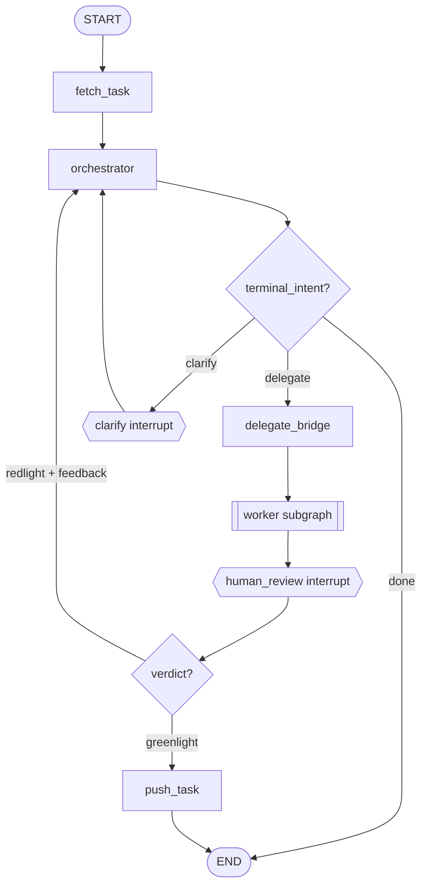

# §0.0 Acknowledgement

The byline credits me as the source and Claude Opus 4.7 as the writer. This
acknowledgement is just because it is difficult to separate AI influence
from human decisions. Though this acknowledgement should not undermine
the value of the decisions made in this document, it should explain how
the decisions were made and, in part, why they exist.

- Joseph, May 7th, 2026.

# Table of Contents

- §0.0 Acknowledgement
- §1.0 Glossary
- Executive Summary
- Must Solve Soon
- §2.0 Agent Types
  - §2.1 Context
  - §2.2 Target Users
  - §2.3 User Stories
  - §2.4 Functional Requirements
  - §2.5 Non-Functional Requirements
  - §2.6 Open Questions
  - §2.7 Mock Flow
  - §2.8 Cross-Cutting Tradeoffs
- §3.0 Control Flow
  - §3.1 Context
  - §3.2 Target Users
  - §3.3 User Stories
  - §3.4 Functional Requirements
  - §3.5 Non-Functional Requirements
  - §3.6 Open Questions
  - §3.7 Mock Flow
  - §3.8 Cross-Cutting Tradeoffs
- §4.0 Task Management
  - §4.1 Context
  - §4.2 Target Users
  - §4.3 User Stories
  - §4.4 Functional Requirements
  - §4.5 Non-Functional Requirements
  - §4.6 Open Questions
  - §4.7 Mock Flow
- §5.0 Context Management
  - §5.1 Context
  - §5.2 Target Users
  - §5.3 User Stories
  - §5.4 Functional Requirements
  - §5.5 Non-Functional Requirements
  - §5.6 Open Questions
  - §5.7 Mock Flow
  - §5.8 Cross-Cutting Tradeoffs
- §6.0 Project Layout
  - §6.1 Context
  - §6.2 Target Users
  - §6.3 User Stories
  - §6.4 Functional Requirements
  - §6.5 Non-Functional Requirements
  - §6.6 Open Questions
  - §6.7 Mock Flow
  - §6.8 Cross-Cutting Tradeoffs
- §7.0 Task Inventory
  - §7.1 Context
  - §7.2 Target Users
  - §7.3 User Stories
  - §7.4 Functional Requirements
  - §7.5 Non-Functional Requirements
  - §7.6 Open Questions
  - §7.7 Mock Flow
  - §7.8 Cross-Cutting Tradeoffs
- Appendix A: Narrative
- Appendix B: User Messages
- Appendix C: Graph Topology (mermaid)
- Appendix D: Task State Transitions (table)
- Appendix E: v2 Messages-Array Shape (table)

# §1.0 Glossary

- **Agent SDK** (Claude Agent SDK): the library form of Claude Code,
  providing the agent loop, tool set, and prompt engineering as a
  programmatic API.
- **Allowlist**: a list of tool names a given agent is permitted to call;
  calls outside the list are gated or denied.
- **Baseline**: the orchestrator's conversation state immediately after spec
  ingest, used as the reset target during compaction.
- **BETTER_VIBES.md**: the declarative conventions document at
  `bv_orchestration/BETTER_VIBES.md`, copied verbatim from BV source on
  `bettervibes init`.
- **BetterVibes** (BV): the orchestration CLI that drives a filesystem task
  queue and coordinates Claude Code workers under human review.
- **bv_orchestration**: the BV root directory inside a consumer project; its
  presence at the project root is the marker that identifies the project
  to the CLI.
- **Checkpointer**: persists graph state to
  `bv_orchestration/checkpoint.sqlite` so an interrupted run can resume.
- **Coarse interrupt**: a pause that exits the CLI process and waits for a
  separate `bettervibes resume` invocation to continue.
- **Compaction**: replacing the orchestrator's accumulated message history
  with a baseline snapshot plus a notes summary, to reclaim context space.
- **Consumer project**: any project that runs the BV CLI; identified by a
  `bv_orchestration/` directory at its root, created by
  `bettervibes init`.
- **Done**: the directory holding greenlit task specs at
  `bv_orchestration/tasks/done/`. Reports do not move here; they live
  permanently in `logs/worker-reports/`.
- **Fail-loud**: the policy that any fatal error raises and exits non-zero,
  surfacing the failure to the human rather than auto-retrying.
- **Fine interrupt**: a pause for a single tool-permission decision that
  streams over stdin/stdout while the CLI process stays live.
- **Greenlight**: the human's verdict accepting a worker report; triggers
  promotion of the task spec from `stage/` to `done/`.
- **HITL** (Human-in-the-Loop): the design choice to gate progress on a
  human verdict rather than an LLM judge.
- **Idempotency check**: an opt-in worker behavior where the worker probes
  the codebase first and writes a "no-op" report if the requested work is
  already in place.
- **`inventory.csv`**: a version-controlled CSV at
  `bv_orchestration/inventory.csv` that lists every T-NN task in the
  project; derived by scanning `tasks/` and `logs/worker-reports/`,
  regenerated incrementally by the vendored `scripts/inventory.ts`.
- **`inventory-sync`**: the `bettervibes inventory-sync` CLI subcommand
  that overwrites a consumer project's vendored `scripts/inventory.ts`
  with BV's bundled source.
- **Iteration**: an attempt at a task; tracked via the task's
  `worker-reports` frontmatter array, which accumulates a WR-NN reference
  per attempt.
- **LangGraph**: the graph engine that defines BV's state machine of nodes,
  edges, and interrupts.
- **Marker**: the `bv_orchestration/` directory itself, whose presence at
  any ancestor of cwd identifies a project; walk-up resolution stops at
  the closest ancestor with the marker.
- **MCP** (Model Context Protocol): the schema-validated tool-call interface
  the Agent SDK uses to expose tools to the model.
- **New**: the directory holding task specs waiting to run at
  `bv_orchestration/tasks/new/`; tasks land here when authored and leave
  on first dispatch.
- **OAuth**: the authentication path the Agent SDK uses to run against a
  Claude Max subscription instead of API billing.
- **PermissionGate**: the BV component that decides, per tool call, whether
  to run silently, prompt the human, or deny.
- **Project root**: the parent of `bv_orchestration/`, resolved by walking
  up from cwd or named explicitly via `--project-root`.
- **Redlight**: the human's verdict rejecting a worker report; carries
  feedback the orchestrator uses to revise instructions and re-delegate.
- **Report**: the markdown file a worker writes to summarize what it did
  during one iteration; lives at
  `bv_orchestration/logs/worker-reports/WR-NN-<slug>-YYYY-MM-DD.md`.
  Synonym: **Worker report**.
- **Resume**: the CLI subcommand that continues a paused graph using a JSON
  decision payload on stdin.
- **Run**: the CLI subcommand that starts a new graph execution for a given
  task id.
- **SDK**: see Agent SDK.
- **Stage**: the directory holding in-flight task specs at
  `bv_orchestration/tasks/stage/`; the spec stays here while one or more
  worker reports accumulate against it, awaiting greenlight.
- **State graph**: the directed graph of nodes the orchestration runs
  through, with conditional edges and interrupt points.
- **Terminal tool**: one of the orchestrator's three MCP tools
  (`delegate_to_worker`, `request_clarification`, `mark_done`) that
  captures the orchestrator's intent and ends its turn.
- **Thread id**: the stable string the checkpointer keys state under; BV
  uses a single fixed value (`bettervibes-main`).
- **Worker**: the executor agent that performs the task and writes a
  report; a thin wrapper around the Agent SDK.

# Executive Summary

BetterVibes orchestrates Claude Code workers under human review on a
filesystem task queue. The system splits work between two agents (§2.0):
an orchestrator that decides what to do next and a worker that carries
it out. Both run on the Claude Agent SDK over a single Claude Max OAuth
path — no API billing. The orchestrator carries no built-in tools; it
signals decisions through three terminal MCP tools
(`delegate_to_worker`, `request_clarification`, `mark_done`) and must
end every turn with exactly one of them. The worker runs the SDK with
the six Claude Code defaults and writes a markdown report when done.

The orchestration loop (§3.0) is a LangGraph state machine: fetch a
task, ask the orchestrator, run the worker, pause for human review, then
promote the task spec on greenlight or revise on redlight. Two interrupt
tiers cover two cadences. Coarse pauses (human review, clarification)
outlive the CLI process and resume from a SQLite checkpoint via
`bettervibes resume`. Fine pauses (per-tool permission decisions) stream
as newline-delimited JSON over the live process's stdio. A
PermissionGate decides each tool call against a base allowlist plus a
session allowlist learned mid-run. The error policy is fail-loud: any
fatal failure raises and exits non-zero with the checkpoint preserved
for human diagnosis.

Tasks live as markdown files inside `bv_orchestration/` (§4.0). The task
spec is the durable artifact that flows through three directories —
`tasks/new/`, `tasks/stage/`, `tasks/done/` — while worker reports
accumulate separately in `logs/worker-reports/` and never move. A single
task can accumulate multiple reports across redlight reworks (1:M); the
task's `worker-reports` frontmatter array references each one by
WR-NN. Filenames carry the schema: tasks are
`T-NN-YYYY-MM-DD.md` and reports are
`WR-NN-<feature-slug>-YYYY-MM-DD.md`. On first run a task moves
`new` → `stage` and its `status` flips accordingly; on greenlight it
moves `stage` → `done`; redlight does not move the task — the array
grows on the next iteration. Tasks are never automatically removed;
once a task lands in `done/` it is permanently closed.

Context management (§5.0) is largely forward-looking. The orchestrator
is designed to stay long-lived across task cycles, which means its
message history grows unbounded — compaction reclaims the space by
resetting `messages` to a baseline snapshot at greenlight and appending
a one-line note per completed task. v1 ships single-task-per-invocation,
so the multi-task compaction never fires; the state schema carries the
v2 fields anyway so v2 can land without a state migration.

Project layout (§6.0) pins BV to a stable answer for "where is this
project's BV state?" The marker `bv_orchestration/` at the project root
identifies the project; the CLI walks up from cwd looking for it, with
closest-ancestor-wins semantics and a `--project-root <path>` escape
hatch when scripts or wrapper agents need to target a project from
outside its tree. An explicit `bettervibes init` subcommand is the only
path that creates the marker, refusing if any ancestor is already a BV
project. When walk-up finds no marker and no override is given, the CLI
fails loud with a clear error and exits 2 — eliminating the
silent-stub failure mode where a misdirected `run` would seed empty
state in the wrong directory.

Task inventory (§7.0) is a derived, committed CSV at
`bv_orchestration/inventory.csv` that lists every T-NN task in the
project — one row per task, sorted ascending by id, with columns for the
source PRD, done status, and dates. The script that regenerates it is
vendored at `bv_orchestration/scripts/inventory.ts` per consumer
project; `bettervibes init` places it there at project creation, and a
new `bettervibes inventory-sync` CLI command refreshes it thereafter by
overwriting the vendored copy unconditionally from BV's bundled source.
Regeneration is incremental: only changed rows are rewritten, so per-row
git blame and PR diffs stay clean. The data model is unchanged — every
column reads from data that T-NN and WR-NN files already carry. Dates
come from filenames; `prd_source` normalizes the existing `prd-source`
frontmatter; `is_done` reads the existing `status` frontmatter. CI
integration (GH Actions triggers, push-to-main commit-back, PR
fail-if-stale) is scoped to a follow-on PRD.

# Must Solve Soon

This section flags active issues with the shipped design that are
acceptable for v1 but should land before BV is used routinely on
consumer projects with non-trivial worker runs.

## Resumption from `stage/` after a crashed worker run

`fetchTaskNode` only fetches from `bv_orchestration/tasks/new/`. If a
worker run crashes after the task spec has been moved to
`bv_orchestration/tasks/stage/` (in the window between `fetchTaskNode`
and `commitTask`), a fresh `bettervibes run T-NN` will fail with `Task
not found`. The user has to manually move the spec back to `tasks/new/`
to retry.

The PRD's task lifecycle (§4.0) assumes the happy path. A clean fix
adds a resume-from-stage branch in `fetchTaskNode` that detects an
in-flight task by `T-NN` match in `tasks/stage/` and continues from
there without re-moving or re-flipping `status`. This needs an explicit
FR in §4.4 and corresponding test coverage; left out of v1 to avoid
expanding the refactor's scope.

# §2.0 Agent Types

## §2.1 **Context** | *Agent Types*

The orchestration system separates planning from execution into two
distinct agent types, each with its own context envelope and tool surface.
The orchestrator decides what to do next; the worker carries it out.
Mixing the two roles in a single agent — the configuration that preceded
BV — wastes context on planning concerns the executor does not need, and
obscures which agent is acting at any given moment. Splitting them keeps
responsibilities clean and makes routing decisions explicit.

Both agents run on the same Agent SDK over OAuth, so a single Claude Max
subscription covers both without API billing. The orchestrator runs on
`claude-sonnet-4-6` with no built-in tools and exactly three terminal MCP
tools that double as a structured-output channel; the worker runs on the
SDK's defaults with the six standard Claude Code tools. The terminal-tool
pattern (terminal MCP tools chosen over free-form text markers — see §2.8)
leverages the SDK's schema-validated tool call interface as the
orchestrator's signaling mechanism rather than a custom parser over
assistant prose.

## §2.2 **Target Users** | *Agent Types*

1. Human developer: invokes `bettervibes` from the consumer project,
   authors task specs, and reviews worker reports.
2. Claude Code: invokes the BV CLI on the human's behalf and relays coarse
   and fine events between the human and the orchestrator.
3. Orchestrator agent: receives task content and prior state in a per-turn
   user prompt; emits exactly one terminal-tool decision per turn.
4. Worker agent: receives synthesized instructions plus task content;
   produces a report file at the
   `bv_orchestration/logs/worker-reports/` path.

## §2.3 **User Stories** | *Agent Types*

1. Human developer: "As the human, I want one agent to plan and another to
   execute, so that the planner's context isn't burned on tool-call
   detail."
2. Human developer: "As the human, I want both agents on my Claude Max
   subscription, so that I'm not paying for API billing on top of what I
   already have."
3. Orchestrator agent: "As the orchestrator, I want to signal my decision
   through a tool call, so that the framework can route on a
   schema-validated value rather than parsing my prose."
4. Worker agent: "As the worker, I want the SDK's default agent loop and
   tool set, so that I can execute without re-engineering Claude Code's
   behaviors."

## §2.4 **Functional Requirements** | *Agent Types*

FR-1: The orchestrator runs each turn as a fresh SDK `query()` call with a
manufactured user prompt built from current graph state (task content,
prior reports, prior verdicts and feedback, included files).

FR-1-tradeoffs:
a. Stateless turns chosen over SDK session continuity — the SDK's session
   storage cannot be relied on across process exits, and graph state in
   LangGraph's checkpointer is the durable record.
b. Reconstructing the prompt each turn costs prompt-prefix tokens but keeps
   the orchestrator's context shape inspectable from graph state alone.

FR-2: The orchestrator's `query()` is configured with `tools: []`,
`allowedTools` naming exactly the three terminal MCP tools, and
`permissionMode: 'dontAsk'`.

FR-2-tradeoffs:
a. The empty `tools` list alone would suffice; the explicit allowlist is
   defense-in-depth against any future SDK behavior that re-enables
   built-ins.
b. `dontAsk` is safe here because the only callable surface is the three
   orchestrator tools, all of which are explicitly intended.

FR-3: The orchestrator exposes exactly three terminal MCP tools —
`delegate_to_worker(instructions)`, `request_clarification(question)`, and
`mark_done()` — each implemented as a closure over a shared context
object. Calling one captures the intent and ends the turn.

FR-3-tradeoffs:
a. Terminal MCP tools chosen over a structured-text marker in assistant
   prose: tool calls are schema-validated at the SDK boundary; text
   protocols require a parser with its own failure modes.

FR-4: Every orchestrator turn must end with exactly one terminal tool
call. If the SDK loop drains without one, the orchestrator node throws
with the last assistant text excerpt for diagnosis.

FR-4-tradeoffs:
a. Fail-loud chosen over silent-retry: prompt drift surfaces as an explicit
   failure rather than a loop that silently re-prompts the model.

FR-5: The orchestrator does not perform task retrieval (`fetchTask`) or
task promotion (`pushTask`). Both run as graph-side nodes.

FR-5-tradeoffs:
a. Graph-side fetch and push remove timing agency from the orchestrator —
   side effects are deterministic and visible in the graph topology.

FR-6: The worker runs the SDK with `cwd` set to the resolved project root
(see §6.0 FR-7), `allowedTools` set to the six Claude Code defaults
(`Read`, `Edit`, `Write`, `Bash`, `Glob`, `Grep`), and the orchestrator's
synthesized instructions plus task content in the user prompt.

FR-6-tradeoffs:
a. Inheriting the SDK's default system prompt and agent loop chosen over a
   custom worker prompt — re-engineering Claude Code's behaviors was not
   the point of BV.

FR-7: The worker's prompt ends with a directive to write a report at
`bv_orchestration/logs/worker-reports/WR-NN-<feature-slug>-YYYY-MM-DD.md`
following the structure of `WORKER_REPORT_TEMPLATE.md` (Executive
Summary, Implementation, Files Touched, Acceptance Criteria Status,
Locked-in Decisions, Open Questions, Worker's Narrative).

FR-7-tradeoffs:
a. Worker self-reports chosen over a structured side-channel: the report
   is a human-readable artifact that doubles as the human-review input.
b. Template-shaped report chosen over freeform prose — the standardized
   sections give the human reviewer predictable landing points.

FR-8: The worker is short-lived. Each iteration is a fresh SDK invocation;
no state carries between attempts.

FR-9: When the task spec sets `idempotency_check: true` in frontmatter,
the worker first probes the codebase to see whether the work is already in
place. If it is, the worker writes a "No-op: already complete" report
instead of redoing the work; the report flows through human review like
any other.

FR-9-tradeoffs:
a. Probe-first chosen as opt-in, not default — a redundant pass surfaces
   in human review, but a false skip silently drops work; the safer
   default is to do the task.

## §2.5 **Non-Functional Requirements** | *Agent Types*

NFR-1: Both agents authenticate via the Agent SDK's OAuth path
(`CLAUDE_CODE_OAUTH_TOKEN`) so usage runs against the human's Claude Max
subscription rather than incurring API billing.

NFR-1-tradeoffs:
a. Agent SDK chosen over `@langchain/anthropic` (`ChatAnthropic`) for the
   orchestrator — the latter authenticates only via the Messages API and
   would force API billing.

NFR-2: The orchestrator runs on `claude-sonnet-4-6`.

## §2.6 **Open Questions** | *Agent Types*

Q1. "Should a reviewer agent be added if human review becomes a
bottleneck?"
Q2. "How will spec loading scale once the spec count grows past what fits
cleanly in the orchestrator's context (per-task manifest, on-demand reads,
indexed approach)?"
Q3. "Should the worker gain limited context awareness in future versions
if task complexity demands it?"

## §2.7 **Mock Flow** | *Agent Types*

Flow A: *orchestrator turn — delegate path*
1. The graph enters the orchestrator node with `task_content` populated
   and prior `messages` set.
2. The orchestrator node builds a user prompt from current state and
   starts an SDK `query()` (FR-1, FR-2).
3. The model reasons and calls `delegate_to_worker` with synthesized
   instructions (FR-3).
4. The tool handler captures `{kind: 'delegate', instructions}` into the
   shared context and returns `"Delegating to worker."`.
5. The SDK loop drains; the orchestrator node reads the captured intent
   and writes it to `state.terminal_intent` (FR-4).

Flow B: *worker iteration*
1. The graph enters the worker subgraph; the iteration counter increments.
2. The worker assembles its prompt from the orchestrator's instructions,
   the task content, and the report-path directive (FR-6, FR-7).
3. The worker invokes the SDK with the six Claude Code defaults and runs
   to completion (FR-6, FR-8).
4. The commit node verifies a report file exists at
   `bv_orchestration/logs/worker-reports/WR-NN-<slug>-YYYY-MM-DD.md` and
   records the path in state.

## §2.8 **Cross-Cutting Tradeoffs** | *Agent Types*

a. (Other) Two agent types chosen over a single multi-role agent —
   separating planner from executor keeps context envelopes lean and
   routing explicit.
b. (Cost) Agent SDK chosen for both agents over hand-rolled or
   API-billing libraries — OAuth path makes Claude Max usage covered.
c. (Other) Terminal MCP tools chosen over structured text markers — tool
   calls are schema-validated; text parsers fail at the edges (§8.1 of
   source spec).

# §3.0 Control Flow

## §3.1 **Context** | *Control Flow*

The orchestration loop is a state machine that walks each task from
retrieval to human sign-off and either onward (greenlight) or back through
the orchestrator with feedback (redlight). Defining the loop as a graph
rather than imperative control flow makes the blocking points first-class
and the routing decisions inspectable. Two interrupt tiers cover two
distinct cadences: coarse pauses (human review, clarification) outlive the
CLI process and resume from a checkpoint; fine pauses (single
tool-permission decisions) stay in-process and stream over stdio.

The graph is single-task-per-invocation in v1 — one CLI run handles fetch
through greenlight, then exits. Multi-task session mode (the orchestrator
running tasks back-to-back inside one process) is deferred to v2 (§5.0).
State persists across coarse interrupts via a SQLite checkpointer keyed
under a single fixed thread id; on greenlight the runner clears the thread
so the next run starts fresh. The fail-loud policy (any fatal error raises
and exits non-zero) keeps recovery in the human's hands.

## §3.2 **Target Users** | *Control Flow*

1. Human developer: receives coarse events, replies with greenlight,
   redlight (with feedback), or clarification answers.
2. Claude Code: streams the CLI's NDJSON events, surfaces them to the
   human, and pipes the human's decision back via `bettervibes resume` or
   stdin.
3. Orchestrator agent: receives prior verdicts and feedback as part of its
   per-turn prompt; replies with one of three terminal-tool decisions.
4. PermissionGate: mediates the worker's tool calls; emits a fine event
   for non-allowlisted calls and waits for a stdin response.

## §3.3 **User Stories** | *Control Flow*

1. Human developer: "As the human, I want the CLI to pause at human
   review and exit, so that I can take however long I need without holding
   a process open."
2. Human developer: "As the human, I want tool-permission prompts to
   stream while the worker runs, so that I can answer them in flow without
   restarting the run."
3. Human developer: "As the human, I want a `no_active_task` signal when
   I resume against an empty thread, so that I know to start a new run
   instead of guessing why nothing happened."
4. Orchestrator agent: "As the orchestrator, I want redlight feedback fed
   back into my next prompt, so that I can revise instructions without
   losing context."

## §3.4 **Functional Requirements** | *Control Flow*

FR-1: The graph topology is `START → fetch_task → orchestrator →
(delegate | clarify | done)`. The `delegate` branch routes through
`delegate_bridge → worker → human_review → (greenlight → push_task → END
| redlight → orchestrator)`. The `clarify` branch routes through a
`clarify` interrupt back to `orchestrator`. The `done` branch routes
directly to `END` with no `push_task`. The `push_task` node moves the
task spec from `tasks/stage/` to `tasks/done/`, not the report (which
lives permanently in `logs/worker-reports/`). See Appendix C for the
diagram.

FR-1-tradeoffs:
a. `push_task` runs only on the greenlight path so a `mark_done` with no
   prior worker run does not move a nonexistent task spec.

FR-2: Coarse interrupts (`human_review`, `clarify`) pause via dynamic
`interrupt()` calls, exit the CLI process, and resume on a separate
`bettervibes resume` invocation that reads a JSON decision from stdin.

FR-2-tradeoffs:
a. Coarse-via-process-exit chosen over a long-running daemon — review can
   sit for minutes or hours; holding a process open across that interval
   is a worse fit for filesystem-bound state.
b. Resume requires the checkpointer to have preserved state under a stable
   thread id (NFR-1).

FR-3: Fine interrupts (`permission_request` / `permission_response`)
stream as newline-delimited JSON over the CLI's stdout/stdin while the run
is live and never cause the process to exit.

FR-3-tradeoffs:
a. In-process fine interrupts chosen because the SDK's agent loop cannot
   be serialized across process exits — a permission decision mid-task
   must stay in-process.

FR-4: The `PermissionGate` owns a base allowlist (the six Claude Code
defaults) plus a session allowlist learned during the run. Tools on either
list run silently; anything else emits a `permission_request` and blocks
until a `permission_response` lands.

FR-4-tradeoffs:
a. The session allowlist is in-process only; it does not persist across
   `bettervibes resume`.
b. `deny` returns a denial to Claude's agent loop, which adapts or fails
   loud; `allow_session` permits the tool for the rest of the Node
   process; `allow` permits this single call.

FR-5: The CLI emits one of four coarse statuses on stdout per invocation:
`interrupted` (with sub-shape `human_review` or `clarify`), `done`, or
`no_active_task`. The process exits after emitting a coarse event.

FR-5-tradeoffs:
a. `no_active_task` (exit code 2) was added to distinguish "nothing to
   resume" from a successful no-op `done`, which the previous behavior
   conflated.

FR-6: On reaching `END` after a `human_review` greenlight (graph path:
`human_review → greenlight → push_task → END`) — i.e., on task promotion
to `done/` — the runner calls `clearThread` against the checkpointer so
the next `bettervibes run` begins on an empty thread.

FR-6-tradeoffs:
a. Deterministic clearing on greenlight chosen over manual
   `bv_orchestration/checkpoint.sqlite` deletion — manual deletion is now
   an escape hatch, not the happy path.

FR-7: The worker subgraph receives a `PermissionGate` through
`RunnableConfig.configurable.permissionGate`. When the gate is present the
SDK runs with `permissionMode: 'default'` and defers each tool decision to
the gate's `canUseTool`. When no gate is injected (tests, non-interactive
callers) the SDK runs with `permissionMode: 'dontAsk'`: allowlisted tools
run, others are silently denied.

FR-8: The CLI accepts three subcommands. `bettervibes init [--project-root
<path>]` creates the BV project marker (see §6.0 FR-4).
`bettervibes run <T-NN> [--include <path1> [<path2> ...]] [--project-root
<path>]` starts a new graph execution against the named task id.
`bettervibes resume [--project-root <path>]` continues a paused graph
from stdin. `--include` paths resolve against the resolved project root,
ENOENT fails loud as `Include file not found: <path>`, and each file
renders into the orchestrator prompt as a `<file path="…">…</file>`
block.

FR-8-tradeoffs:
a. Per-run includes chosen over polluting the task spec with one-off
   context — a spec or design doc relevant to this run only stays out of
   `tasks/new/`.
b. `--project-root` accepted as a global flag on every subcommand so
   wrapper agents can target a specific project from any cwd (see §6.0
   FR-2).

## §3.5 **Non-Functional Requirements** | *Control Flow*

NFR-1: The checkpointer is `SqliteSaver` persisting state at
`bv_orchestration/checkpoint.sqlite` (gitignored) under a single fixed
`thread_id` of `bettervibes-main`.

NFR-1-tradeoffs:
a. Single thread id chosen so baseline messages and accumulated notes
   (v2) tie to one continuous conversation across runs.

NFR-2: On any fatal error (worker crash, tool failure, filesystem error,
push-target collision), the graph raises and the CLI exits non-zero with
the error written to stderr.

NFR-2-tradeoffs:
a. No auto-retry or recovery in v1 — the human diagnoses and retries
   manually; checkpointer state is preserved for inspection.

NFR-3: Errors surface as raw prose on stderr, not as JSON-encoded events,
per the fail-loud policy.

NFR-4: CLI exit codes are: 0 on a coarse interrupt or successful `done`;
1 on a runtime error; 2 on an argv or stdin protocol error, on
`no_active_task`, or on the project-root-missing and
already-initialized errors (§6.0).

## §3.6 **Open Questions** | *Control Flow*

Q4. "Will parallelism land in a future version, or does the sequential
model hold indefinitely?"

## §3.7 **Mock Flow** | *Control Flow*

Flow A: *greenlight happy path*
1. The human runs `bettervibes run T-01` from anywhere inside the
   project tree.
2. The CLI walks up to find `bv_orchestration/`, builds a `Paths` object,
   and invokes the graph (§6.0 FR-1).
3. The graph fetches `bv_orchestration/tasks/new/T-01-2026-05-07.md`,
   moves the spec into `tasks/stage/`, flips its frontmatter `status` to
   `stage`, and enters the orchestrator (FR-1, see Appendix C; §4.0
   FR-4).
4. The orchestrator calls `delegate_to_worker`; the bridge routes into
   the worker subgraph.
5. The worker executes; if it asks to use a non-allowlisted tool, the
   gate emits `permission_request` over stdout (FR-3, FR-4).
6. The human pipes a `permission_response` to stdin; the gate resolves
   and the worker continues.
7. The worker writes the report to
   `bv_orchestration/logs/worker-reports/WR-01-add-auth-2026-05-07.md`
   and the commit node records the path; the orchestrator appends
   `WR-01` to the task's `worker-reports` frontmatter array.
8. The graph hits the `human_review` interrupt; the CLI emits
   `{"status":"interrupted","interrupt":"human_review",
   "report_path":"bv_orchestration/logs/worker-reports/WR-01-add-auth-2026-05-07.md",...}`
   and exits 0 (FR-2, FR-5).
9. The human runs `echo '{"decision":"greenlight"}' | bettervibes
   resume`.
10. `push_task` moves the task spec from
    `bv_orchestration/tasks/stage/T-01-2026-05-07.md` to
    `bv_orchestration/tasks/done/T-01-2026-05-07.md`, flips its `status`
    to `done`; the runner calls `clearThread` (FR-6).
11. The CLI emits `{"status":"done","task_id":"T-01","iterations":1}`
    and exits 0.

Flow B: *redlight loop*
1. Steps 1–8 of Flow A run identically.
2. The human runs `echo '{"decision":"redlight",
   "feedback":"<reason>"}' | bettervibes resume`.
3. The graph routes from `human_review` back to `orchestrator` with the
   feedback in state. The task spec stays in `tasks/stage/`.
4. The orchestrator builds a fresh prompt that includes the prior report
   and the redlight feedback, then calls `delegate_to_worker` with
   revised instructions.
5. The worker subgraph runs again; the iteration counter increments to
   2.
6. The worker writes
   `bv_orchestration/logs/worker-reports/WR-02-add-auth-2026-05-07.md`;
   the commit node records the path; the orchestrator appends `WR-02` to
   the task's `worker-reports` array (now `[WR-01, WR-02]`). The graph
   hits `human_review` again.
7. The CLI emits `human_review` and exits; the human greenlights or
   redlights again.

Flow C: *clarify path*
1. The orchestrator calls `request_clarification("…")` instead of
   delegating.
2. The graph hits the `clarify` interrupt; the CLI emits
   `{"status":"interrupted","interrupt":"clarify","question":"…"}` and
   exits 0.
3. The human runs `echo '{"decision":"clarify","answer":"…"}' |
   bettervibes resume`.
4. The answer is fed into the orchestrator's next prompt; the
   orchestrator decides again.

Flow D: *no_active_task*
1. The human runs `bettervibes resume` against a thread with no pending
   interrupt (e.g., right after a previous greenlight).
2. The CLI emits `{"status":"no_active_task","message":"…"}` and exits
   2 without invoking the graph (FR-5).

## §3.8 **Cross-Cutting Tradeoffs** | *Control Flow*

a. (Other) LangGraph chosen over hooks-based orchestration — hooks fire
   uniformly regardless of agent type; the orchestration layer needs
   graph-aware routing with explicit state machines, conditional edges,
   and per-node control.
b. (Other) Single-task-per-invocation chosen over multi-task session mode
   for v1 — simpler topology, no in-graph queue state, deferred multi-task
   design lives in §5.0 / §8.2 of the source spec.

# §4.0 Task Management

## §4.1 **Context** | *Task Management*

Tasks live as markdown files inside `bv_orchestration/`. Three
subdirectories represent task lifecycle state: `tasks/new/` holds specs
waiting to run, `tasks/stage/` holds in-flight specs awaiting human
review, and `tasks/done/` holds greenlit specs. Worker reports
accumulate separately in `logs/worker-reports/` and never move; a task
gathers references to its reports through its `worker-reports`
frontmatter array. The directory layout plus that frontmatter array are
the entire schema — no external store, no in-memory cache, no separate
index.

The task spec is the durable artifact that flows through states; the
report is an append-only artifact attached to a task by reference. A
single task can accumulate multiple reports across redlight reworks
(1:M), and each report's status (`red` or `green`) lives in its own
frontmatter rather than on the task. Authoring a task means writing a
file under `tasks/new/`; the IDE remains the task interface. Tasks are
never automatically removed — once a task lands in `done/` it is
permanently closed, and spec revisions that need rework are authored as
new tasks with new ids.

## §4.2 **Target Users** | *Task Management*

1. Human developer: authors task specs in `bv_orchestration/tasks/new/`,
   reviews reports in `bv_orchestration/logs/worker-reports/`, and
   references closed tasks in `bv_orchestration/tasks/done/`.
2. Claude Code: invokes `bettervibes run <T-NN>` against task ids the
   human names.
3. Worker agent: writes report files into
   `bv_orchestration/logs/worker-reports/` at the WR-NN path.
4. Graph runtime: fetches the task spec from `bv_orchestration/tasks/new/`
   on first run and moves it through `stage/` to `done/`; the orchestrator
   appends each WR-NN to the task's `worker-reports` array.

## §4.3 **User Stories** | *Task Management*

1. Human developer: "As the human, I want tasks as plain markdown files
   in directories, so that I can author and inspect them with the same
   tools I use for code."
2. Human developer: "As the human, I want the task spec to flow through
   states and reports to accumulate as a visible audit trail, so that the
   directory layout itself tells me where each task stands and what
   redlight reworks happened along the way."
3. Human developer: "As the human, I want tasks never deleted, so that
   `tasks/done/` is documentation of completed work, not a consumable
   queue."
4. Worker agent: "As the worker, I want a deterministic report path, so
   that the commit node can verify my output without parsing my prose."

## §4.4 **Functional Requirements** | *Task Management*

FR-1: Bootstrapping the four subdirectories (`tasks/new/`, `tasks/stage/`,
`tasks/done/`, `logs/worker-reports/`) plus the `BETTER_VIBES.md`
conventions document is the responsibility of `bettervibes init` (see
§6.0 FR-4). `run` and `resume` do not create these directories — they
require an already-initialized project.

FR-1-tradeoffs:
a. Init-only creation chosen over implicit-on-run creation — refusing to
   silently seed state in the wrong place is the failure mode the
   redesign exists to fix.

FR-2: Task files follow `T-NN-YYYY-MM-DD.md` (e.g.,
`T-01-2026-05-07.md`). Worker report files follow
`WR-NN-<feature-slug>-YYYY-MM-DD.md` (e.g.,
`WR-01-add-auth-2026-05-07.md`). The `<feature-slug>` is derived from
the task spec's `# Task: <name>` H1 — lowercased, with non-alphanumeric
runs collapsed to single hyphens — and falls back to `task` when the
H1 is absent or empty.

FR-2-tradeoffs:
a. Sequential T-NN id chosen over filename-as-content-id — the date
   suffix provides ordering at a glance; the slug-free task name keeps
   the id stable when content evolves.
b. Slug carried on the report but not the task — readers scan a list of
   reports far more often than a list of tasks, and the slug is the
   scanning aid.
c. Slug derivation from the H1 chosen over a frontmatter field — keeps
   the task spec's frontmatter shape minimal and reuses content the
   author already writes.

FR-3: A worker report corresponds to a task iff the task's
`worker-reports` frontmatter array contains the report's WR-NN id.

FR-3-tradeoffs:
a. Explicit reference chosen over implicit filename match — supports the
   1:M task-to-reports relationship cleanly, and survives renames or
   slug changes that would break filename-derived correspondence.

FR-4: `fetchTaskNode` runs once at graph start. It locates the task in
`bv_orchestration/tasks/new/` by matching the `T-NN-` prefix of its
filename, loads the file's content into `state.task_content`, moves the
spec into `bv_orchestration/tasks/stage/`, and flips the frontmatter
`status` field from `new` to `stage`. A missing task file fails loud
with a `Task not found` error.

FR-4-tradeoffs:
a. Move-on-first-run chosen over in-place state via frontmatter alone —
   directory placement is the at-a-glance signal humans scan; frontmatter
   is the machine signal. Both kept aligned.

FR-5: `pushTaskNode` runs only on the greenlight path. It moves the task
spec from `bv_orchestration/tasks/stage/` to
`bv_orchestration/tasks/done/` and flips the frontmatter `status` from
`stage` to `done`. A push-target collision fails loud with `push target
exists`.

FR-5-tradeoffs:
a. Move the task spec, not the reports — reports live permanently in
   `logs/worker-reports/` regardless of color, so the redlight trail
   is visible in one place rather than split across `staged/` and
   `done/`.

FR-6: A redlight verdict does not move the task. The spec stays in
`bv_orchestration/tasks/stage/`. On the next iteration, the worker
writes a fresh report file and the orchestrator appends the new WR-NN
to the task's `worker-reports` frontmatter array.

FR-6-tradeoffs:
a. Stay-in-stage chosen over bouncing back to `new/` — the task is in
   flight, not pending; `stage/` is the right home for the duration of
   review-and-rework.

FR-7: `commitTask` writes the worker report to
`bv_orchestration/logs/worker-reports/WR-NN-<slug>-YYYY-MM-DD.md` and
updates the source task's `worker-reports` frontmatter array with the
new WR-NN reference. Both actions are part of the same commit step;
either both land or neither does.

FR-7-tradeoffs:
a. Atomic-pair chosen over a separate "attach" step — the report and the
   task's reference to it are the same fact recorded in two places;
   splitting them invites drift.

FR-8: Tasks are never automatically removed from
`bv_orchestration/tasks/`. Cancellation is "don't run it"; manual cleanup
is via version control.

FR-9: Task spec frontmatter may set `idempotency_check: true` to opt the
worker into probing for already-complete work; the worker writes a
"No-op: already complete" report instead of redoing it. The report flows
through human review like any other (cross-ref Agent Types §2.0, FR-9).

## §4.5 **Non-Functional Requirements** | *Task Management*

NFR-1: The filesystem (the directory layout plus task frontmatter) is
the single source of truth for task state. No database, no external
indexing, no in-memory cache of task state.

NFR-2: The empty-queue check fires once per run. Tasks added to
`bv_orchestration/tasks/new/` during an in-flight run are picked up on
the next `bettervibes run` invocation, not mid-run.

## §4.6 **Open Questions** | *Task Management*

Q5. "Once it becomes important, should report frontmatter carry
reviewer-identity (who greenlit) and reviewer-notes metadata?
(Timestamps fall outside this question — §7.0 settled date sourcing
on filenames.)"

## §4.7 **Mock Flow** | *Task Management*

Flow A: *task lifecycle*
1. The human writes
   `bv_orchestration/tasks/new/T-01-2026-05-07.md` with frontmatter
   `status: new` and an empty `worker-reports` array.
2. The human runs `bettervibes run T-01`. `fetchTaskNode` reads the
   file, moves it into `tasks/stage/`, and flips its frontmatter
   `status` to `stage` (FR-4).
3. The worker writes
   `bv_orchestration/logs/worker-reports/WR-01-add-auth-2026-05-07.md`;
   the orchestrator appends `WR-01` to the task's `worker-reports`
   array (FR-7).
4. The human redlights with feedback.
5. The task spec stays in `tasks/stage/`. The worker writes
   `WR-02-add-auth-2026-05-07.md`; the array grows to
   `[WR-01, WR-02]` (FR-6, FR-7).
6. The human greenlights. `pushTaskNode` moves the task spec from
   `tasks/stage/` to `tasks/done/` and flips its `status` to
   `done` (FR-5). Both reports remain in `logs/worker-reports/`
   permanently.
7. Future runs that target `T-01` again can detect the closed state by
   checking `tasks/done/`.

See Appendix D for the state-transition table.

# §5.0 Context Management

## §5.1 **Context** | *Context Management*

The orchestrator is intended to be long-lived across multiple task
cycles, which means its conversation history grows without bound unless
the system intervenes. Compaction is the intervention: at greenlight, the
orchestrator's `messages` array resets to a baseline snapshot taken right
after spec ingest, then appends a notes log — one short entry per
completed task. Every greenlight reclaims context space while preserving
an awareness of what has been done.

Compaction is a v2 feature in BV. v1 ships single-task-per-invocation,
which means there is no second task within one run to compact between,
and the multi-task design never fires. The state schema carries
`baseline_messages` and `accumulated_notes` fields anyway so the v2 work
can land without a state migration; the v1 graph never reads or writes
them. The accumulated-notes log is the only LLM-generated piece of the
reset — everything else is a deterministic replacement.

## §5.2 **Target Users** | *Context Management*

1. Orchestrator agent (v2): reads a compacted message history at the
   start of each post-greenlight turn; writes a one-line note summarizing
   the completed task.
2. Graph runtime (v2): on greenlight, replaces `state.messages` with
   `baseline_messages` plus a system message rendering the accumulated
   notes log.
3. Human developer (v2): reads accumulated notes if needed to understand
   orchestrator awareness across tasks.

## §5.3 **User Stories** | *Context Management*

1. Orchestrator agent (v2): "As the orchestrator, I want a baseline reset
   on greenlight, so that my context window doesn't fill up after a few
   tasks."
2. Orchestrator agent (v2): "As the orchestrator, I want a notes log with
   deviations flagged, so that I know which prior work needs special
   attention going forward."
3. Human developer: "As the human, I want v1 to ship without compaction,
   so that single-task-per-invocation lands fast and v2 can layer on
   without a state migration."

## §5.4 **Functional Requirements** | *Context Management*

FR-1 (v2): On greenlight, the graph replaces `state.messages` with
`baseline_messages` plus a single `SystemMessage` whose content is the
full `accumulated_notes` array rendered as a bulleted list under a
"Prior completed work in this thread:" header.

FR-1-tradeoffs:
a. Replace-not-append chosen for the messages reducer in v2 —
   append-only would defeat the purpose of compaction.
b. The system message is regenerated on each reset so it always reflects
   the current notes array.

FR-2 (v2): On greenlight, the orchestrator writes one note entry to
`accumulated_notes` before the reset. Each entry has a required Summary
line — `{task_id}: {one-line summary}` — and an optional Remarks line
included only when implementation diverged from the task spec.

FR-2-tradeoffs:
a. Most tasks execute cleanly to spec and omit the Remarks line; remarks
   exist as a signal that future-orchestrator should pay attention to
   deviations.

FR-3 (v2): `baseline_messages` is set once per thread, immediately after
the orchestrator's first spec-ingest turn, and never changes afterward.

FR-4 (v1 forward-compatibility): The state schema includes
`baseline_messages` and `accumulated_notes` fields with appropriate
reducers. v1 code does not write or read either field.

FR-4-tradeoffs:
a. Carrying the fields in v1 is low cost; building them deliberately for
   v1 would inflate scope without buying v1 anything.
b. v2 reuses the v1 orchestrator node unchanged — only the graph
   topology shifts.

## §5.5 **Non-Functional Requirements** | *Context Management*

NFR-1 (v2): The Summary line of a note entry is hard-capped at 200
characters.

## §5.6 **Open Questions** | *Context Management*

Q6. "What triggers `baseline_messages` capture in v2 — first
orchestrator turn, explicit setup node, or first non-spec input?"
Q7. "Does the multi-task v2 graph reuse the same fixed `thread_id`, or
shift to per-session ids when sessions become a first-class concept?"

## §5.7 **Mock Flow** | *Context Management*

Flow A: *v2 multi-task session, greenlight reset*
1. Session starts; the orchestrator ingests specs on its first turn.
2. The graph captures `state.messages` into `state.baseline_messages`
   (FR-3).
3. Task A runs through to greenlight.
4. Before resetting, the orchestrator writes the note `{task_a:
   <summary>}` to `accumulated_notes` (FR-2).
5. The graph resets `state.messages` to `baseline_messages` plus a
   `SystemMessage` containing the notes log (FR-1).
6. Task B starts; the orchestrator's first turn sees baseline + one
   note, not the full task-A history.
7. After task B greenlights, the notes log grows to two entries; the
   system message rebuilds.

See Appendix E for the messages-array shape across phases.

## §5.8 **Cross-Cutting Tradeoffs** | *Context Management*

a. (Future-proofing) v2 fields carried in v1 state — accepts dead weight
   in v1 to avoid a state migration for v2.
b. (Other) Compaction deferred to v2 chosen over delivering it in v1 —
   single-task-per-invocation has no within-run compaction need;
   multi-task mode is the natural home for it.

# §6.0 Project Layout

## §6.1 **Context** | *Project Layout*

BV needs a stable answer to "where is this project's BV state?" — every
CLI invocation has to resolve that without depending on raw cwd, since a
misdirected invocation under a cwd-bound resolution silently seeds an
empty state tree in the wrong place. The marker pattern
(`bv_orchestration/` at the project root, walk up from cwd looking for
it, fail loud on miss) matches the discipline of git, npm, and cargo,
where a marker file or directory defines the root and the tool refuses
to silently create state in the wrong place. Closest-ancestor-wins
semantics mean any subdirectory of the project resolves to the same
root.

The visible-not-hidden naming reflects what `bv_orchestration/` holds:
committed-conventions content (BETTER_VIBES.md, task specs, reports),
not opaque runtime state. The lone gitignored artifact is
`checkpoint.sqlite`. An explicit `bettervibes init` subcommand separates
"create a project" from "operate on a project," eliminating the
silent-stub failure mode where a misdirected `run` would create an empty
`bv_orchestration/` in the wrong directory. A `--project-root <path>`
escape hatch on every subcommand lets scripts and wrapper agents target
a specific project from outside its tree.

## §6.2 **Target Users** | *Project Layout*

1. Human developer: invokes `bettervibes init` once per consumer project;
   thereafter runs `bettervibes run` / `resume` from any subdirectory of
   the project tree.
2. Claude Code: invokes the BV CLI on the human's behalf; can pass
   `--project-root` when driving multiple projects from a single
   conversation.
3. CLI runtime: resolves the project root at boot, builds a `Paths`
   object, and threads it to the graph and worker subprocess.

## §6.3 **User Stories** | *Project Layout*

1. Human developer: "As the human, I want to run BV from any subdirectory
   of my project, so that I don't have to cd to the project root every
   time."
2. Human developer: "As the human, I want BV to fail loud when I'm not
   in a BV project, so that a typo doesn't silently create a stub
   directory in the wrong place."
3. Human developer: "As the human, I want an explicit init step, so that
   creating a BV project is a deliberate act rather than a side effect of
   any subcommand."
4. Human developer: "As the human, I want a `--project-root` override,
   so that scripts and wrapper agents can target a specific project from
   outside its tree."

## §6.4 **Functional Requirements** | *Project Layout*

FR-1: At boot, the CLI resolves the project root by calling `realpath`
on `process.cwd()` (or on the argument to `--project-root`, if given)
and walking up looking for a `bv_orchestration/` directory; the closest
ancestor with the marker wins. Walk-up stops at the filesystem root.

FR-1-tradeoffs:
a. Closest-ancestor-wins matches git's discipline — predictable, no
   surprises in nested workspaces.
b. Realpath first ensures the same physical project resolves to the same
   root regardless of which symlinked alias the user is sitting in.

FR-2: A `--project-root <path>` global flag overrides walk-up resolution
and points the CLI at the named directory directly.

FR-2-tradeoffs:
a. Override flag chosen as an escape hatch over an environment variable
   — explicit on the command line, no inheritance surprises in scripts.

FR-3: When walk-up finds no marker and no override is given, the CLI
fails loud with the agreed-on error message and exits 2 without invoking
the graph. The message reads:

```
fatal: not a bettervibes project
no `bv_orchestration/` found in <cwd> or any parent directory
run `bettervibes init` to create one, or pass --project-root <path>
```

FR-3-tradeoffs:
a. Fail-loud chosen over silent stub creation — a misdirected `run`
   should never seed a half-initialized `bv_orchestration/` in the wrong
   directory.

FR-4: `bettervibes init [--project-root <path>]` creates
`bv_orchestration/` at the resolved target with these contents:
`tasks/new/` (empty), `tasks/stage/` (empty), `tasks/done/` (empty),
`logs/worker-reports/` (empty), `BETTER_VIBES.md` (copied verbatim
from `<bv-source>/docs/templates/BETTER_VIBES_TEMPLATE.md`), and
`scripts/inventory.ts` (copied verbatim from BV's bundled source — the
same vendor mechanism `bettervibes inventory-sync` provides; see §7.0).
Init prints a confirmation including the gitignore hint for
`checkpoint.sqlite`.

FR-4-tradeoffs:
a. Verbatim copy of `BETTER_VIBES.md` chosen over per-project
   parameterization — the document is generic conventions, and a
   committed copy is discoverable to Claude Code reading the project.

FR-5: `bettervibes init` refuses if walk-up from the target finds an
existing `bv_orchestration/` at any level (including the target itself),
exiting 2 with `fatal: already initialized at <path>`.

FR-5-tradeoffs:
a. Refuse-not-idempotent chosen so a misdirected init in a nested
   location surfaces as an explicit failure rather than silently
   creating a second project.

FR-6: `bettervibes init` does not create `checkpoint.sqlite`.
`SqliteSaver` creates the file on first `run`; init only ensures the
parent directory (`bv_orchestration/`) exists.

FR-6-tradeoffs:
a. Lazy checkpoint creation chosen so the file's existence is a signal
   that a run has actually occurred, not just that init was run.

FR-7: The worker subprocess receives `cwd: <resolved project root>`
(the parent of `bv_orchestration/`), not raw `process.cwd()`.

FR-7-tradeoffs:
a. Worker cwd pinned to the project root chosen so a worker invoked
   from a subdirectory still operates against the project tree the
   human authored the task against.

FR-8: All subcommands (`init`, `run`, `resume`) accept `--project-root
<path>` as a global flag. `run` and `resume` perform walk-up resolution
when the flag is omitted; `init` uses cwd when the flag is omitted.

## §6.5 **Non-Functional Requirements** | *Project Layout*

NFR-1: `bv_orchestration/` is visible, not hidden — the dot-prefix
convention is reserved for runtime state. Within `bv_orchestration/`,
only `checkpoint.sqlite` is gitignored; tasks, reports, and
`BETTER_VIBES.md` are durable artifacts and committed.

NFR-1-tradeoffs:
a. Visible-marker chosen over hidden `.bv/` — the directory holds
   committed-conventions content, not opaque state, so the dot-prefix
   would mislead.

NFR-2: Init does not auto-edit `.gitignore`. The confirmation message
names the one path the user should add manually.

NFR-2-tradeoffs:
a. Hands-off chosen — matches `git init` / `npm init` / `cargo new` and
   avoids surprising edits to a file the user owns.

## §6.6 **Open Questions** | *Project Layout*

(none — the policy is locked.)

## §6.7 **Mock Flow** | *Project Layout*

Flow A: *init from a fresh project root*
1. The human runs `cd ~/Projects/foo && bettervibes init`.
2. Walk-up from `foo` finds no `bv_orchestration/` (FR-5 passes).
3. Init creates `bv_orchestration/` with the four subdirectories and
   `BETTER_VIBES.md` (FR-4) and prints the confirmation.
4. Future runs from `foo` or any subdirectory resolve to `foo` as the
   project root (FR-1).

Flow B: *run from a subdirectory*
1. The human runs `cd ~/Projects/foo/src/components && bettervibes run
   T-01`.
2. Walk-up from `components` ascends through `src` to `foo`, finds
   `foo/bv_orchestration/`, and resolves project root to `foo` (FR-1).
3. The graph executes against `foo/bv_orchestration/`.

Flow C: *run from outside any project*
1. The human runs `cd ~/tmp && bettervibes run T-01`.
2. Walk-up reaches the filesystem root with no marker; the CLI emits
   the agreed-on fatal error and exits 2 (FR-3).

Flow D: *override*
1. A wrapper script runs `bettervibes run T-01 --project-root
   ~/Projects/foo` from any cwd.
2. The flag bypasses walk-up; the graph executes against `foo` (FR-2).

Flow E: *misdirected init refused*
1. The human, already inside `foo` (which has `bv_orchestration/`),
   runs `bettervibes init` again.
2. Walk-up finds the existing marker; init refuses with `fatal: already
   initialized at <path>` and exits 2 (FR-5).

## §6.8 **Cross-Cutting Tradeoffs** | *Project Layout*

a. (Other) Marker-based resolution chosen over implicit-cwd — matches
   git/npm/cargo discipline; eliminates the silent-stub failure mode.
b. (Other) Visible `bv_orchestration/` chosen over hidden `.bv/` —
   directory holds committed-conventions content, not opaque runtime
   state.
c. (Other) Explicit `init` separated from `run`/`resume` — refuse-loud
   on miss vs. silent stub.
d. (Other) `--project-root` flag chosen over environment variable for
   the override — explicit on the command line, no inheritance surprises.

# §7.0 Task Inventory

## §7.1 **Context** | *Task Inventory*

A version-controlled inventory of every task in the project lives as a
single CSV file at a stable path, so the human dev and any visitor
browsing the repository can scan the full task graph at a glance. The
CSV is derived state, not authored content: a TypeScript script
regenerates it from the existing
`bv_orchestration/tasks/{new,stage,done}/` tree and the `worker-reports`
frontmatter array on each T-NN file. No new schema is introduced on the
task or worker-report side — every column reads from data that the
project's existing lifecycle already records.

The script that builds the CSV is owned by the consumer project rather
than the BV CLI runtime, so a regeneration step in CI runs
deterministically without pinning to a specific BV version. BV ships
the script source in its own repo; `bettervibes init` places the
vendored copy at `bv_orchestration/scripts/inventory.ts`, and a new
sync command (`bettervibes inventory-sync`) overwrites it
unconditionally on demand. CI
integration — the workflow that triggers regeneration and fails reviews
when the CSV is stale — is scoped to a follow-on PRD; this section locks
the data contract, the script, and the sync command only.

## §7.2 **Target Users** | *Task Inventory*

1. Human developer: opens `bv_orchestration/inventory.csv` to scan the
   project's task graph without navigating the lifecycle directories.
2. Repo visitor on GitHub: clicks `inventory.csv` in the repo file
   browser to get a one-glance view of the task graph without cloning.
3. Regeneration script: walks
   `bv_orchestration/tasks/{new,stage,done}/` for T-NN files, reads each
   task's frontmatter, parses the body H1, and walks `worker-reports[]`
   into the matching WR-NN files under
   `bv_orchestration/logs/worker-reports/`.
4. BV CLI (`bettervibes init`, `bettervibes inventory-sync`): place or
   overwrite the consumer project's vendored `scripts/inventory.ts`
   from BV's bundled source — init at project creation, sync thereafter.

## §7.3 **User Stories** | *Task Inventory*

1. Human developer: "As the human, I want a single CSV listing every
   task in the project, so that I can scan status, dates, and source
   PRDs at a glance instead of walking three directories."
2. Repo visitor: "As a visitor browsing the repo on GitHub, I want the
   inventory to be a checked-in CSV, so that I can open it directly in
   the file browser without cloning."
3. Human developer: "As the human, I want the regeneration script
   vendored per-project, so that the project's CI runs deterministically
   without pinning to a specific BV CLI version."
4. Human developer: "As the human, I want `bettervibes inventory-sync`
   to overwrite the vendored copy unconditionally, so that pulling in a
   new version of the script is one command with no diff resolution."

## §7.4 **Functional Requirements** | *Task Inventory*

FR-1: The inventory CSV lives at `bv_orchestration/inventory.csv` and is
committed to git. The file is not gitignored; it is the durable,
version-controlled artifact this feature produces.

FR-2: The CSV header row is exactly
`task_id,task_name,prd_source,is_done,date_added,date_finished`. Rows
are sorted ascending by `task_id`, lexicographic on the `T-NN` string.

FR-3: For each T-NN file present under
`bv_orchestration/tasks/{new,stage,done}/`, the script writes one row.
Tasks in `new/` and `stage/` produce rows with `date_finished` blank.

FR-3-tradeoffs:
a. All three buckets contribute rows chosen over a done-only ledger —
   the CSV represents the project's task graph in full, including queued
   and in-flight work, not just closed work.

FR-4: Column derivations:
- `task_id`: the `T-NN` prefix of the filename (e.g., `T-21`).
- `task_name`: the slug after `# Task: ` in the spec body's H1.
- `prd_source`: the T-NN frontmatter `prd-source` value with leading
  directories and the `.md` extension stripped (e.g.,
  `docs/backend/backend.spec.v1.md` → `backend.spec.v1`); blank when the
  field is absent.
- `is_done`: `true` iff the T-NN frontmatter `status` equals `done`;
  `false` otherwise.
- `date_added`: the `YYYY-MM-DD` portion of the T-NN filename.
- `date_finished`: the `YYYY-MM-DD` portion of the most recent WR-NN
  filename referenced in the T-NN's `worker-reports` array when
  `is_done = true`; blank otherwise.

FR-4-tradeoffs:
a. Filename-derived dates chosen over frontmatter `date` fields or git
   log — both filenames already carry the date, no new schema and no
   git lookup required.
b. `prd-source` normalization (strip dirs and `.md`) chosen over the
   verbatim path — produces a clean human-readable label while keeping
   the original path recoverable by frontmatter inspection.
c. `is_done` derived from frontmatter `status` chosen over directory
   presence — frontmatter is the machine signal already used elsewhere
   in BV (§4.0 FR-4, FR-5); reading it here preserves a single source
   of truth for task state.

FR-5: The regeneration script lives at
`bv_orchestration/scripts/inventory.ts` in each consumer project,
vendored from BV's source. It is implemented in TypeScript and invoked
directly from the project root (e.g.,
`npx tsx bv_orchestration/scripts/inventory.ts`).

FR-6: Regeneration is incremental. The script reads the existing
`inventory.csv`, derives the fresh row set from the filesystem, and
rewrites only those rows whose derived values differ from the existing
row. Unchanged rows are emitted bytewise-identical so git blame and PR
diffs surface only what actually changed.

FR-6-tradeoffs:
a. Incremental chosen over from-scratch — the CSV is committed and any
   noise in diffs is visible in PR review; preserving per-row blame
   matters.
b. Incremental adds complexity to the script vs from-scratch —
   accepted because the CSV is small (one row per task) and read-write
   cost is dominated by the filesystem scan, not the write.

FR-7: The scanner correlates T-NN files with WR-NN files via the T-NN's
`worker-reports` frontmatter array. For each `WR-NN` reference, the
scanner globs `bv_orchestration/logs/worker-reports/WR-NN-*.md` to
locate the file; the most recent WR-NN's filename date (the
`YYYY-MM-DD` portion) provides `date_finished`.

FR-7-tradeoffs:
a. Glob on the WR-NN prefix chosen because the scanner does not need
   to know the slug or date — both are recoverable from the directory
   listing; the array reference is the durable contract.

FR-8: The BV CLI exposes
`bettervibes inventory-sync [--project-root <path>]`. The command copies
BV's bundled `scripts/inventory.ts` over the resolved project's
`bv_orchestration/scripts/inventory.ts`, unconditionally overwriting any
local modifications. The script is shipped inside the `bettervibes` npm
package and located at runtime via `require.resolve` (or the
equivalent). `bettervibes init` performs the initial vendor at project
creation time (§6.0 FR-4); `inventory-sync` is the update path
thereafter.

FR-8-tradeoffs:
a. Unconditional overwrite chosen over diff-and-prompt — keeps the
   upgrade path one command; local edits to the vendored script are
   not a supported customization point and would be lost on the next
   sync.
b. Vendoring chosen over exposing the regenerator as a CLI subcommand
   (e.g., `bettervibes inventory`) — each consumer project's CI should
   not depend on a globally-installed BV version; the script ships with
   the project's git history and runs deterministically.

## §7.5 **Non-Functional Requirements** | *Task Inventory*

NFR-1: The feature is purely additive to BV's existing schema. No
changes to T-NN or WR-NN frontmatter shape; no new fields, renames, or
removals. The only new authored artifacts are `inventory.csv` and
`scripts/inventory.ts` per consumer project.

NFR-2: A T-NN file missing its `prd-source` field (legacy specs or
PRD-less tasks) does not fail the script. The corresponding row carries
a blank `prd_source` cell.

NFR-3: A T-NN file with `status: done` whose `worker-reports` array is
empty, or whose referenced WR-NN files cannot be located on disk, does
not fail the script. The row carries a blank `date_finished` cell.

NFR-3-tradeoffs:
a. Permissive-on-missing chosen over fail-loud — the inventory
   degrades gracefully on legacy or partial data; data-model drift is
   not the inventory's concern.

NFR-4: The script exits non-zero only on genuine filesystem errors
(cannot read `tasks/`, cannot write `inventory.csv`). Schema
irregularities (missing fields, unparseable frontmatter, orphaned WR-NN
references) emit warnings on stderr but do not block regeneration.

## §7.6 **Open Questions** | *Task Inventory*

Q8. "What follow-on PRD covers the GH Actions workflow — the trigger
configuration, the push-to-main commit-back behavior, and the
fail-PR-if-stale check?"
Q9. "Does the script need a one-time migration helper for consumer
projects that already have a `bv_orchestration/` but no inventory CSV?"

## §7.7 **Mock Flow** | *Task Inventory*

Flow A: *first-time generation*
1. `bettervibes init` has previously placed
   `bv_orchestration/scripts/inventory.ts` from BV's bundled source
   (§6.0 FR-4); the vendored script is already on disk.
2. The human runs `npx tsx bv_orchestration/scripts/inventory.ts` from
   the project root.
3. The script scans `bv_orchestration/tasks/{new,stage,done}/` for T-NN
   files (FR-3).
4. For each T-NN file, the script reads frontmatter (`status`,
   `prd-source`, `worker-reports`) and parses the body H1 for
   `task_name` (FR-4).
5. For each T-NN with `status: done`, the script globs
   `logs/worker-reports/WR-NN-*.md` for each referenced WR-NN and
   selects the most recent by filename date for `date_finished` (FR-7).
6. The script writes `bv_orchestration/inventory.csv` with the
   snake_case header and rows sorted ascending by `task_id` (FR-2).
7. The human commits `inventory.csv` to git.

Flow B: *incremental update after a greenlit task*
1. The graph promotes T-25 from `tasks/stage/` to `tasks/done/` on
   greenlight, flipping its `status` frontmatter to `done` (§4.0 FR-5).
2. The human runs `npx tsx bv_orchestration/scripts/inventory.ts`.
3. The script reads the existing `inventory.csv` and scans the
   filesystem fresh.
4. T-25's `is_done` derivation flips to `true` and `date_finished`
   resolves; every other row derives identically to its existing
   value (FR-6).
5. The script rewrites only T-25's row; all other rows are emitted
   bytewise-identical.
6. The human commits the diff; git blame on unchanged rows is preserved
   (FR-6 tradeoffs).

Flow C: *legacy T-NN without `prd-source`*
1. The scanner encounters a T-NN whose frontmatter lacks `prd-source`
   (NFR-2).
2. The scanner emits the row with a blank `prd_source` cell and no
   warning.
3. The script proceeds normally.

Flow D: *T-NN marked done with an unresolvable WR-NN reference*
1. The scanner encounters T-13 with `status: done` and
   `worker-reports: [WR-99]`, but `logs/worker-reports/WR-99-*.md` is
   missing (NFR-3).
2. The scanner emits a warning on stderr naming T-13 and WR-99, emits
   T-13's row with `date_finished` blank, and continues.
3. The script exits 0 (warnings are non-fatal per NFR-4).

## §7.8 **Cross-Cutting Tradeoffs** | *Task Inventory*

a. (Other) Vendoring chosen over a CLI subcommand for the regenerator
   — keeps consumer-project CI self-contained without a runtime BV
   dependency; `inventory-sync` is the only CLI-side surface for this
   feature.
b. (Future-proofing) GH Actions integration scoped to a follow-on PRD
   — this PRD locks the data contract, the regeneration script, and
   the sync command; CI behavior (triggers, commit-back semantics,
   stale-check) needs its own treatment.
c. (Other) Filename-derived dates chosen over a richer WR-NN
   frontmatter contract — keeps the worker schema unchanged; the
   precision loss (no time-of-day) is not material to a task-graph
   inventory.
d. (Other) Incremental regeneration chosen over from-scratch —
   preserves per-row git blame; the CSV is committed and PR-review-
   visible, so diff cleanliness matters.

# Appendix A: Narrative

I converted an existing v1 orchestration spec for BetterVibes into the
PRD shape this template defines, then in a later session redesigned the
system's project layout, file structure, and resolution policy and
propagated those changes through the document.

For the initial conversion, I read the source spec end-to-end before
drafting. Four feature blocks emerged from the spec's section structure:
agent types, control flow, task management, and context management. I
treated the architectural decisions in §1.2 of the source spec as
cross-cutting tradeoffs scoped to whichever feature each one most
clearly belonged to — LangGraph-over-hooks under control flow, Agent
SDK-over-hand-rolled under agent types, single-task-per-invocation as a
v1 framing decision under control flow, terminal MCP tools under agent
types. The two §8 honorable-mentions items (structured-text alternative,
multi-task session mode) folded into the same per-feature tradeoffs and
into the §5.0 forward-looking design.

I drew the line between FR and NFR by treating behavior the system
performs as functional and quality attributes (auth path, error policy,
exit codes, model id, single-source-of-truth) as non-functional. The
terminal-tool contract, the graph topology, the staged-to-done promotion
rule, and the iteration-suffix convention all landed as FRs; the OAuth
path, the fail-loud policy, the SQLite checkpointer's location, and the
200-char summary cap landed as NFRs. I treated v2 Context Management as
a feature in its own right rather than an open question, and one v1 FR
(FR-4) carries the forward-compatibility commitment that the state
schema include the v2 fields without exercising them.

The §3 Direction items in the source spec — parallelism, reviewer agent,
scalable spec loading, traceability metadata — became Open Questions
distributed under whichever feature each one most clearly belonged to.

In follow-up turns, the user asked for three structural changes: 80-char
line wrap throughout, dropping the `>` blockquote and indentation from
FR and NFR statements, and an inclusive treatment of appendices so each
new appendix carries one supplemental artifact. I applied the first two
across the document and split the supplemental visuals across three
appendices: Appendix C (mermaid graph topology), Appendix D (task
state-transitions table), and Appendix E (v2 messages-array shape
table). Subsequent turns added the feature-name suffix on subsection
headers as a scanning aid, a Table of Contents between §0.0 and §1.0,
and an Executive Summary placed between §1.0 Glossary and the first
feature.

In a later session, the user surfaced a recurring failure mode: BV's
CLI was creating a fresh `tasks/` directory and a fresh
`.bettervibes/checkpoint.sqlite` whenever it was invoked from a
directory other than the consumer project root, silently seeding stub
state in the wrong place. I traced the cause to module-load constants
in `src/cli/bettervibes.ts` and the four tool modules under `src/tools/`
that resolve their paths against `process.cwd()` at import time. I
surveyed git, npm, cargo, and hg for the canonical pattern and
identified five shared traits: a marker file or directory that names the
root unambiguously, walk-up resolution from cwd, fail-loud on miss, an
explicit init command as the only path that creates the marker, and an
escape-hatch override flag.

I proposed three threading shapes for propagating the resolved root
through the codebase — full DI through the graph (Shape A), a
module-level singleton (Shape B), and a lazily-read environment
variable (Shape C). The user chose Shape A: a `Paths` object built once
at boot in `bettervibes.ts` and threaded through
`buildBetterVibesGraph`, with each tool module exposing a
`make<Tool>(paths)` factory in place of its module-load constant.

The user then redesigned the directory layout. The marker became
`bv_orchestration/` — visible, not hidden — sitting at the project
root. Inside it: `tasks/{new,stage,done}/` for the task lifecycle,
`logs/worker-reports/` for every worker report ever produced,
`checkpoint.sqlite` as the only gitignored runtime artifact, and
`BETTER_VIBES.md` as a declarative conventions document copied verbatim
from BV source on init. The lifecycle inverted from v1: the task spec
became the durable artifact that flows through `new/` → `stage/` →
`done/`, while worker reports accumulate as append-only artifacts in
`logs/worker-reports/` and are referenced from the task's
`worker-reports` frontmatter array (1:M). A redlight verdict no longer
moves anything; the task stays in `stage/` and the array grows on the
next iteration.

I drafted three template files for the new design and saved them under
`<bv-source>/docs/templates/`: `TASK_TEMPLATE.md` (frontmatter for
author, date, prd-source, worker-reports, status, idempotency_check;
sections for description, Acceptance Criteria, Touches, Spec Sections),
`WORKER_REPORT_TEMPLATE.md` (frontmatter for model, prd-source, date,
status; sections for Executive Summary, Implementation, Files Touched,
Acceptance Criteria Status, Locked-in Decisions, Open Questions,
Worker's Narrative), and `BETTER_VIBES_TEMPLATE.md` (declarative
conventions covering layout, lifecycle, PRDs, CLI, authentication). The
Worker Report's Locked-in Decisions section landed with a story-shaped
framing — each entry names the gap in the spec, the call the worker
made, and the reasoning — so future iterations can see why the choice
now binds them.

I locked the resolution policy with four answers from the user: a
`--project-root <path>` escape hatch on every subcommand,
refuse-on-already-initialized for `bettervibes init`, an explicit
handoff that the worker subprocess receives the resolved project root
rather than raw `process.cwd()`, and the agreed-on fatal error message
when walk-up finds no marker. The init script settled around four
decisions: target resolution by walk-up or override, refuse-not-
idempotent on existing markers, deferred creation of `checkpoint.sqlite`
(SqliteSaver creates it on first run), and no auto-edit of `.gitignore`
(matching `git init`, `npm init`, `cargo new`).

The redesign added §6.0 Project Layout as a new feature block covering
the marker, walk-up resolution, the override flag, the init script, the
worker-cwd handoff, and the visible-not-hidden naming choice. I rewrote
§4.0 Task Management around the new lifecycle and the new file naming
(`T-NN-YYYY-MM-DD.md` for tasks, `WR-NN-<slug>-YYYY-MM-DD.md` for
reports), made surgical updates to §2.4 FR-7 and §3.4 FR-1/FR-6/FR-8 and
§3.5 NFR-1 to align with the new paths and argv, and rewrote
Appendix D's state-transition table to track task states rather than
report-promotion.

In a later session, the user proposed a CSV-based task inventory for
consumer projects: a single `bv_orchestration/inventory.csv` listing
every T-NN with task id, name, source PRD, done status, date added, and
date finished. I started from the v1 PRD I had stored in
`~/collaborate/topics/T-07-bettervibes/` and quickly discovered the file
was stale — it described the old `ingest/staged/done` lifecycle and the
old `{task-id}-{iteration}.md` report-filename scheme, both of which
had been replaced by `tasks/{new,stage,done}/` plus
`T-NN-YYYY-MM-DD.md` task specs and append-only
`WR-NN-<slug>-YYYY-MM-DD.md` reports living under
`logs/worker-reports/`, referenced by a `worker-reports` frontmatter
array on each task. I rebased my model against the BV-repo PRD and
against real T-NN and WR-NN samples from Stoicheon, then made the
BV-repo PRD the sole edit target — consistent with the user's prior
decision to delete the collaborate copy.

I interviewed the user across seven rounds of structured questions,
surfacing tensions when the answers conflicted with each other or with
the actual repo state. Three came up. First, an early answer locked in
a "minimal `completed_at` field on WR-NN" while a later answer routed
all date derivation through filenames; I flagged the redundancy and the
user picked filenames-only. Second, an early answer named a new
`prd-source` T-NN frontmatter field as the source for the `PRD Source`
column, but the field already existed on real T-NN samples; I flagged
the existing field and the user kept it. Third, an early "standalone
script in BV repo only" answer carried a description that contradicted
the consumer-project location the user had picked for the CSV; I
flagged the split and the user re-routed to a vendored-per-project
script plus a new `bettervibes inventory-sync` CLI command that
overwrites the vendored copy unconditionally.

The final shape of §7.0 Task Inventory captures: a per-project CSV at
`bv_orchestration/inventory.csv`; a snake_case header; rows sorted
ascending by `task_id`; columns derived from T-NN frontmatter, the body
H1, and the most recent WR-NN filename in the `worker-reports` array;
incremental regeneration to preserve git blame on unchanged rows; and
CI integration deferred to a follow-on PRD. The Glossary picked up two
new terms (`inventory.csv`, `inventory-sync`), the Table of Contents
gained eight subsection entries under §7.0, and the Executive Summary
gained a paragraph synthesizing the feature alongside the existing
four.

# Appendix B: User Messages

This PRD was converted from a pre-existing synthesis spec rather than
authored from a transcript. The predecessor spec and its changelog
previously lived under `docs/orchestration/` in the BetterVibes
repository and were removed when this PRD took their place. There is no
chronological audit trail of user messages from the spec's original
drafting to record here.

The retired changelog covered v1 work between 2026-04-24 and 2026-04-27
— the `--include` flag, deterministic checkpoint clearing on greenlight,
and the `no_active_task` coarse event — all of which are reflected in
this PRD's body. Git history on the deleted file remains available via
`git log` for readers who need the original commit-level audit trail.

## From Joseph, to Claude Opus 4.7, submitted on 2026-05-07

1.  > Read T-07 C-00.

    *Claude read the C-00 conversation record from topic T-07.*

2.  > We're working in BetterVibes today (currently under construction).
    > Find it at @~/Projects/BetterVibes/.

    *Claude oriented to the BetterVibes project, refreshed the README
    and quick-start guide, and asked what to work on.*

3.  > I have a plan on changing the workflow. Currently, BV reads from a
    > task/ingest, outputs redlight worker reports to staged, and moves
    > greenlight reports to done. The problem is running BV. I've found
    > that BV likes to create a new tasks folder depending on the user's
    > CWD. We should make it so BV is pinned to a specific location
    > (e.g., the target repo's root)

    *Claude restated the failure mode — silent stub creation under
    arbitrary cwd — and asked for the plan.*

4.  > We should learn how/where BV inits a new task queue and
    > .checkpoint file so that we can pin it down.

    *Claude grepped the source for cwd-bound resolution sites, located
    the single init point in `src/cli/bettervibes.ts` and five
    downstream consumers, and flagged the module-load timing constraint
    for any pinning scheme.*

5.  > Walk through (a), how would it work?

    *Claude walked through three threading shapes for propagating a
    resolved project root — DI through the graph, a module-level
    singleton, a lazily-read environment variable — and recommended
    Shape A.*

6.  > 1. How does `npm`, `git`, and other package cli tools solve this
    >    problem?
    > 2. I'm leaning towards shape A.

    *Claude tabled the canonical marker-and-walk-up pattern as
    practiced by git, npm, cargo, and hg, drew out the five shared
    traits, and acknowledged Shape A as the chosen threading shape.*

7.  > We have a couple tasks:
    > - Flesh out the resolution policy
    > - Design an `bettervibes init` script, this skill should:
    > * create a `bettervibes/`
    > * use a (new) file design, something I haven't told you yet
    > * include a setting.json that links the project-level bettervibes/
    >   to the project's PRDs.
    > - Refactor to the new resolution policy
    >
    > Overall, we need to reconsider the file structure, init script,
    > and pin the resolution. Any questions?

    *Claude listed the questions blocking the next steps — file-design
    shape, naming visibility, PRD-link semantics, sequencing — and
    waited.*

8.  > A few scope-tighting clarifications:
    > - On second thought, we should drop the setting.json link file. I
    >   discovered its not necessary.
    > - Sequence looks good.
    >
    > I will walk you through the new file design

    *Claude acknowledged the dropped settings.json link and the agreed
    sequence; waited for the file design.*

9.  > # Walkthrough
    >
    > 1. user runs `bettervibes init` to create the bv_orchestration
    >    directory
    >
    > # File System
    >
    > ```
    > bv_orchestration/
    > | BETTER_VIBES.md     # (a conventions document that declares how Claude should use bettervibes)
    > | logs/
    > | | worker-reports/   # Contains the worker report artifacts (both redlight and greenlight reports).
    > | |   WR-NN-<feature-slug>-YYYY-MM-DD.md
    > | tasks/
    > | | new/                    # renamed ingest to 'new'
    > | | | T-NN-YYYY-MM-DD.md    # These are tasks waiting to be run
    > | | stage/ # renamed staged to 'stage'
    > | | | T-NN-YYYY-MM-DD.md    # These are tasks waiting for a greenlight.
    > | | done/
    > | | | T-NN-YYYY-MM-DD.md    # Finished tasks
    > ```
    >
    > # Differences
    >
    > - Worker reports (WR-NN) should output to
    >   `bv_orchestration/logs/worker-reports/` instead of staged.
    > - Worker reports (WR-NN) should use a template
    > - Tasks (T-NN) should move (new -> stage -> done) during the
    >   workflow.
    > - Tasks (T-NN) should use a template.
    >
    > # Worker Report Template (WR-NN)
    >
    > ### YAML frontmatter
    >
    > model: <AI model, e.g., Claude Opus 4.7>
    > prd-source: <path-to-prd>
    > date: YYYY-MM-DD
    > status: red | green
    >
    > ## Executive Summary
    >
    > Then the worker fills in it's report here.
    >
    > ## Implementation and Locked-in Decisions
    >
    > *these are things that the worker implemented*
    >
    > - item 1
    >
    > ## Locked-in Decisions
    >
    > - statement
    > - statement
    >
    > ## Open Questions
    >
    > *these are things such as: deviations from the spec, ambiguities
    > from the spec, or anything else to flag.*
    >
    > Q: <question>?
    > Q: <question>?
    >
    > ## Appendix A: Worker's Narrative
    >
    > *Worker's narrative, similiar to the talk-thoughtfully skill and
    > the first-person narrative in the record-conversation skill*
    >
    > -
    > We're going to need to flesh this out. Ask me your questions.
    > When we're done, we will save this template to
    > `bettervibes/docs/templates/WORKER_REPORT_TEMPLATE.md`.
    >
    > # Task Template (T-NN)
    >
    > ### YAML Front-matter
    > author: Joseph, as told to <AI-Model>
    > date: YYYY-MM-DD
    > prd-source: <path-to-prd>
    > worker-reports: [WR-NN, WR-NN, ...]
    > status: new | staged | done
    >
    > ## Instructions
    > ...
    >
    > ## Requirements
    > ...
    >
    > -
    > The key idea is the orchestrator should add the worker-report to
    > the YAML-frontmatter of the T-NN, and change its status from
    > new->staged->green We're going to need to flesh this out. Ask me
    > your questions. When we're done, we will save this template to
    > `bettervibes/docs/templates/TASK_TEMPLATE.md`.
    >
    > --
    > Inspiration | Extra Resources
    > - `/talk-thoughtfully` skill (for overall tone and guidelines)
    > - `/prd` skill (for executive summary, open-questions, functional
    >   requirements, NF requirements)
    > - `/record-conversation` skill (for tone, voice, narrative
    >   structure)

    *Claude grouped its questions into layout, worker-report, and
    task-template clusters; surfaced six layout questions, one
    worker-report duplication, two task-template shape questions; baked
    in conventions for narrative tone, criteria status, files touched,
    and idempotency.*

10. > 1. Yes
    > 2. (i) red | green. (ii) tasks are new, stage, done because it's
    >    a 1:M mapping - one T-NN can map to multiple WR-NN
    > 3. Task stays in staged. We update it's worker-reports value
    > 4. Filesystem relative to the project root. The convention will
    >    be defined by the project owner. (most likely live in
    >    docs/prds/PRD-NN-<slug>-v<version number>.md
    > 5. checkpoint file lives in bv_orchestration
    > 6. Multiple questions here: (i) yes, (ii) yes, (iii) similiar
    >    shape, but we're not going to phrase it as "teaching claude".
    >    We'll be more declarative (e.g., "this is how things are
    >    setup")
    > 7. Typo. These should be two distinct sections
    > 8. just keep the WR-NN.
    > 9. Use existing conventions. I didn't know we already had this
    >    spec'd out.

    *Claude resolved the residual layout questions, confirmed the
    section split for the worker report, and presented full drafts of
    `WORKER_REPORT_TEMPLATE.md` and `TASK_TEMPLATE.md` for review.*

11. > I had to refresh my developer window. Can restate your previous
    > response?

    *Claude restated the two template drafts and the three residual
    decisions verbatim.*

12. > R1. bv_orchestration/checkpoint.sqlite
    > R2. Good.
    > R3. Yes, but locked-in decisions should capture the story,
    > "worker was faced with a choice (something outside of the spec)
    > so it made it a decision"

    *Claude revised the Locked-in Decisions framing to capture the
    story shape and saved both templates to
    `<bv-source>/docs/templates/`.*

13. > I think the resolution policy is pretty locked-down. Is there
    > anything I'm missing?

    *Claude surfaced four real gaps — override flag, init-against-
    already-initialized, worker subprocess cwd, and the on-miss error
    message — and four edge cases acceptable as defaults.*

14. > 1. Sure. Add the escape hatch, e.g., --project-root <path>
    > 2. Let's refuse by saying "already initialized"
    > 3. Good flag.
    > 4. Good fatal error message.

    *Claude pivoted to the init script and the
    `BETTER_VIBES_TEMPLATE.md` draft; presented both for review.*

15. > S1. call it template.
    > S2. No. We'll catch mistakes during runs too.

    *Claude saved `BETTER_VIBES_TEMPLATE.md` and asked which thread to
    pick up next.*

16. > O1: Update docs/prds/PRD-*.md (the BV-source PRD). THe collobrate
    > PRD will be deleted eventually.
    > O2: I prefer atomic

    *Claude scoped the refactor against the BV-source PRD, listed every
    section that needed editing, and committed to an atomic update.*

## From Joseph, to Claude Opus 4.7, submitted on 2026-05-17

1.  > I have a plan to improve BetterVibes orchestration
    > (../Projects/BetterVibes).
    >
    > # Goal
    > Maintain a spreadsheet inventory of all tasks in repo.
    >
    > # Implementation
    > Bettervibes worker reports encode information that can be digested
    > by a script to update a .csv file.
    >
    > # Integration
    > - FR: integratable with GitHub Actions
    >
    > # Spreadsheet Shape
    > | Task-ID | Task-Name | PRD Source | isDone? | Date Added | Date
    > Finished |
    >
    > I'm sure there's a lot of questions. Please interview me
    > relentlessly until we can create a PRD.

    *Claude opened the existing v1 PRD, found it stale relative to the
    BV-repo copy, surveyed BV's source and consumer projects to ground
    the real T-NN / WR-NN model, and opened the interview with three
    scoping questions on audience, CSV location, and data-source
    mechanism.*

2.  > [Round 1 selections — Audience: human dev + repo visitors via
    > GitHub; Location: consumer project, tracked in git; Data source
    > (free-form Other):]
    >
    > > You might be operating on an old data model. The correct task
    > > buckets are `new`, `stage`, and `done`. Also, in order to get
    > > the full picture of what was done, you must compare the T-nn
    > > files with the corresponding WR-nn files.

    *Claude grounded against the actual BV codebase, identified the
    real model (T-NN spec + WR-NN reports + `worker-reports[]`
    linkage), flagged that the collaborate copy of the PRD was stale,
    and asked four questions covering the target PRD file, the scanner
    mechanism, the PRD-source field, and CI triggers.*

3.  > [Round 2 selections — Target file: BV-repo PRD only; Scanner
    > mechanism: T-NN + WR-NN frontmatter (not bodies); PRD source: new
    > T-NN frontmatter field; CI triggers: push to main + pull
    > request.]

    *Claude asked four implementation-contract questions: the WR
    frontmatter shape, the date sourcing, the CSV path, and the CI
    behavior on push and PR.*

4.  > [Round 3 selections — WR frontmatter: minimal `completed_at`
    > only; Date sourcing: both from filenames; CSV path:
    > `bv_orchestration/inventory.csv`; CI behavior: commit regenerated
    > CSV back to main on push.]

    *Claude surfaced two tensions — `completed_at` vs filename-dates,
    and PR-trigger vs PR-behavior — and asked four resolution
    questions covering the date contract, the PR behavior, the script
    home, and empty-task handling.*

5.  > [Round 4 selections — Date contract: filenames only, no WR
    > frontmatter change; PR behavior: fail check if CSV stale; Script
    > home: standalone script in BV repo only; Empty tasks: yes, with
    > blank `date_finished`.]

    *Claude sampled real T-NN and WR-NN files from Stoicheon and the BV
    templates, identified two more corrections (the `prd-source` field
    already exists; the "BV-internal only" script home contradicted the
    consumer-project CSV location), and asked four questions covering
    PRD-source confirmation, the Task-Name source, the script
    distribution, and the CSV format.*

6.  > [Round 5 selections — PRD source (free-form Other):]
    >
    > > Normalize the path, but th prd-source column should allow null
    > > values.
    >
    > [Task-Name: H1 of spec body; Distribution: vendored per-project
    > with `bettervibes inventory-sync` updater; Format: snake_case
    > headers sorted ascending by `task_id`.]

    *Claude asked four cleanup questions on normalization semantics,
    the vendor path, the sync semantics, and the language plus
    regeneration strategy.*

7.  > [Round 6 selections — Normalization: strip dirs AND `.md`; Vendor
    > path: `bv_orchestration/scripts/inventory.ts`; Sync semantics:
    > overwrite vendored copy unconditionally; Language + strategy:
    > TypeScript, incremental update.]

    *Claude asked two final cleanup questions on `is_done` derivation
    and the GH workflow-file scoping.*

8.  > [Round 7 selections — `is_done`: frontmatter `status: done`;
    > Workflow file: defer workflow scope to a follow-on PRD.]

    *Claude drafted §7.0 Task Inventory with eight subsections, added
    two new Glossary entries (`inventory.csv`, `inventory-sync`),
    updated the Table of Contents, added a §7.0 paragraph to the
    Executive Summary, appended a synthesis paragraph to Appendix A,
    and saved the file in place.*

# Appendix C: Graph Topology (mermaid)

*Referenced from Control Flow §3.4 FR-1 and §3.7 Flow A.*



The `push_task` node moves the task spec from
`bv_orchestration/tasks/stage/` to `bv_orchestration/tasks/done/`;
worker reports stay permanently in `bv_orchestration/logs/worker-reports/`
and never move regardless of the verdict.

# Appendix D: Task State Transitions (table)

*Referenced from Task Management §4.7 Flow A.*

| Transition              | Trigger                  | Mechanism                                                                                                       |
| ----------------------- | ------------------------ | --------------------------------------------------------------------------------------------------------------- |
| (none) → new            | human authors task spec  | write `bv_orchestration/tasks/new/T-NN-YYYY-MM-DD.md`                                                           |
| new → stage             | `bettervibes run <T-NN>` | `fetchTaskNode` moves spec to `tasks/stage/`, flips frontmatter `status` to `stage`                             |
| stage → stage (rework)  | redlight + feedback      | task stays in `stage/`; worker writes new WR-NN to `logs/worker-reports/`; orchestrator appends WR-NN to array  |
| stage → done            | greenlight               | `pushTaskNode` moves task spec from `tasks/stage/` to `tasks/done/`, flips `status` to `done`                   |
| (worker iteration)      | task in `stage/`         | worker writes `logs/worker-reports/WR-NN-<slug>-YYYY-MM-DD.md`; commit node updates task's `worker-reports`     |
| done → done             | (no auto-removal)        | task is documentation, not a queue                                                                              |

# Appendix E: v2 Messages-Array Shape (table)

*Referenced from Context Management §5.7 Flow A.*

| Phase                     | `state.messages` content                                     |
| ------------------------- | ------------------------------------------------------------ |
| Pre-spec-ingest           | (empty)                                                      |
| Post-spec-ingest          | spec ingest dialogue (also captured into `baseline_messages`) |
| Mid-task A                | baseline + task-A delegation/review messages                 |
| Post-task-A reset         | `baseline_messages` + `SystemMessage(notes_log = [A])`       |
| Mid-task B                | reset state + task-B delegation/review messages              |
| Post-task-B reset         | `baseline_messages` + `SystemMessage(notes_log = [A, B])`    |
